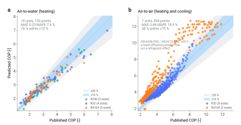

<div align="center">

# TMHP: Thermodynamic Models for Heat Pumps

**Cycle-resolved heat-pump models for Python studies, EnergyPlus plants, and FMI co-simulation**

_Refrigerant-agnostic · condition-agnostic · integration-ready · first-principles from the cycle up_

[](https://www.python.org)
[](#license)
[](https://bet-lab.github.io/TMHP/)
[](http://www.coolprop.org)

[**Documentation**](https://bet-lab.github.io/TMHP/) ·
[**Quick start**](https://bet-lab.github.io/TMHP/getting-started/) ·
[**Integrations**](https://bet-lab.github.io/TMHP/integrations/) ·
[**Validation**](https://bet-lab.github.io/TMHP/validation/) ·
Sister project: [**Energy-Exergy Analysis Engine**](https://github.com/bet-lab/enex-analysis-engine)

</div>

---

## Overview

TMHP is a Python library of **thermodynamic cycle models** for heat pumps. The released public model families currently cover air-, ground-, and water-source DHW boilers plus air- and ground-source space-conditioning heat pumps for heating and cooling.

Each released cycle-resolved model family solves the same closed refrigerant cycle from first principles — no manufacturer-specific curve fits, no per-unit recalibration. Swap the refrigerant, change the source side, or move the operating point, and the shared core produces a coherent answer.

TMHP is now also an integration package. The same cycle-resolved heat-pump core can run natively in Python, answer a building-simulator plant callback, or be exported as FMI 2.0 and FMI 3.0 Co-Simulation FMUs. The current EnergyPlus and FMI adapters wrap the validated ASHPB reference implementation, while the documentation keeps that adapter scope separate from the broader refrigerant-cycle model family.

| What you need | What TMHP gives you |
| --- | --- |
| Physics beyond catalogue curves | Refrigerant state points, compressor work, heat exchangers, COP, and convergence diagnostics from a shared thermodynamic cycle core |
| Refrigerant and operating-point studies | Any CoolProp-supported refrigerant can be swapped at runtime without re-fitting empirical coefficients |
| Building-simulation coupling | EnergyPlus Python Plugin support for plant-loop surrogate modeling |
| Tool-to-tool co-simulation | FMI 2.0 and FMI 3.0 FMU export for the current ASHPB `step()` adapter, aligned with the shared cycle core |
| Reproducible validation | Samsung EHS Mono HT Quiet R32 parity benchmark regenerated from source |

---

## Why physics-based?

Most building-energy simulators (EnergyPlus, TRNSYS, and friends) model a heat pump as an empirical curve fit against the manufacturer's catalogue. That is cheap and accurate inside the calibration envelope, but it carries structural limits:

| Curve-fit models                                      | This library                                             |
| ----------------------------------------------------- | -------------------------------------------------------- |
| Tied to the operating range of the original test data | Predictive across the full refrigerant envelope          |
| Refrigerant is baked into the coefficients            | Any CoolProp-supported refrigerant, swappable at runtime |
| Refrigerant state is hidden                           | Full thermodynamic state at every cycle node             |
| Requires re-fitting for every new unit                | One model class, parameterized by geometry & components  |

You pay for it with a few extra parameters and a slightly more expensive time step. What you get in return is a model you can **trust outside its calibration range** — across refrigerants, operating envelopes, and system topologies that no single catalogue covers.

---

## Integration-ready

TMHP keeps the heat-pump thermodynamics in one reusable model boundary instead of duplicating the same component logic for every simulator.

| Integration path | Use it when | TMHP boundary |
| --- | --- | --- |
| [Native Python](https://bet-lab.github.io/TMHP/getting-started/) | You are running design studies, validation, notebooks, or regression tests directly in Python | `analyze_steady()` and `analyze_dynamic()` across released model families; `step()` for the current ASHPB dynamic adapter boundary |
| [EnergyPlus Python Plugin](https://bet-lab.github.io/TMHP/integrations/energyplus-python.html) | EnergyPlus should keep the IDF, schedules, plant loop, tank state, meters, and reporting | TMHP answers each plant-solver request through the current steady ASHPB reference adapter |
| [FMI FMU](https://bet-lab.github.io/TMHP/integrations/fmu.html) | A co-simulation master such as FMPy, Modelica tooling, OMSimulator, Dymola, or Simulink should drive the heat pump as an external component | TMHP provides separate FMI 2.0 and FMI 3.0 adapters over the current ASHPB dynamic boundary: weather, draw, tank, power, heat, COP, and diagnostics |

This makes TMHP useful for whole-building studies, model-based controls, refrigerant screening, heat-pump component benchmarking, and cross-tool validation while keeping the core package independent of any one simulator.

---

## How it works

<div align="center">


<sub><i>Released model-family view — the refrigerant-cycle core stays fixed while the public class boundary changes.</i></sub>

<br/><br/>

<a href="https://bet-lab.github.io/TMHP/concepts/cycle-architecture.html">
  
</a>

<sub><i>Shared cycle architecture — bold blocks are reused across ASHPB, GSHPB, WSHPB, ASHP, and GSHP. <a href="https://bet-lab.github.io/TMHP/concepts/cycle-architecture.html">Open the interactive version →</a></i></sub>

</div>

Each time step solves a closed refrigerant cycle coupled to the surrounding system (tank, building, ground loop, …). The active demand boundary supplies the target duty — tank charge for boiler families or indoor-unit load for space-conditioning families — and the cycle solver selects a feasible minimum-power operating point. The cycle closes on a physical optimum, not on fitted coefficients.

| Sub-model                | Method                                                                                                |
| ------------------------ | ----------------------------------------------------------------------------------------------------- |
| Refrigerant state points | [CoolProp](http://www.coolprop.org) (REFPROP-grade equation of state)                                 |
| Compressor work          | Isentropic + volumetric + mechanical efficiency                                                       |
| Condenser / evaporator   | ε-NTU (effectiveness-NTU) heat exchanger model                                                        |
| Outdoor unit fan         | ASHRAE 90.1-style variable-speed-drive (VSD) power curve + air-side ε-NTU                             |
| Ground heat exchanger    | g-function (ground thermal response) via [pygfunction](https://github.com/MassimoCimmino/pygfunction) |
| PV / solar thermal       | [pvlib](https://pvlib-python.readthedocs.io)-driven irradiance & power                                |
| Cycle closure            | Internal minimization → optimal evaporating temperature                                               |
| Plotting backend         | [dartwork-mpl](https://github.com/dartworklabs/dartwork-mpl) — thin matplotlib utility layer          |

The same refrigerant cycle is reused across the released cycle-resolved families. What varies between models is composed along three independent axes:

- **Environmental medium** — air, ground, or water in the released families. Water is currently exposed as a DHW-boiler family; air and ground also have space-conditioning classes.
- **Demand side** — the released public boundaries are a domestic-hot-water tank or a building load. `AirSourceHeatPump` and `GroundSourceHeatPump` use `Q_r_iu > 0` for cooling and `Q_r_iu < 0` for heating.
- **Auxiliary subsystems** — parallel energy contributors that augment (not replace) the cycle: solar thermal collectors (STC) preheat the tank, photovoltaics (PV) offset compressor and fan electricity, and an energy storage system (ESS) buffers surplus PV generation.

Each concrete model in the [next section](#models) is a fixed, code-backed combination of these axes.

---

## Installation

Requires Python ≥ 3.10 and the [`uv`](https://github.com/astral-sh/uv) package manager.

```bash
git clone https://github.com/bet-lab/TMHP.git
cd tmhp
uv sync
```

That's it — `uv sync` reads `pyproject.toml` and resolves every dependency against the committed `uv.lock`.

Runtime dependencies pulled in automatically:

- [CoolProp](http://www.coolprop.org) · [NumPy](https://numpy.org) · [SciPy](https://scipy.org) · [pandas](https://pandas.pydata.org) · [Matplotlib](https://matplotlib.org)
- [pvlib](https://pvlib-python.readthedocs.io) (PV / solar thermal subsystems) · [pygfunction](https://github.com/MassimoCimmino/pygfunction) (g-function borehole) · [tqdm](https://tqdm.github.io) (progress bars)
- [dartwork-mpl](https://github.com/dartworklabs/dartwork-mpl) — a thin Matplotlib styling layer used by the Mollier-diagram plotters; pulled from the upstream Git repo via `[tool.uv.sources]` since it has no PyPI release.

Optional dev / docs tooling lives behind [PEP 735](https://peps.python.org/pep-0735/) dependency groups, so the runtime install stays lean:

```bash
uv sync --group dev      # ruff, mypy, pytest, pytest-cov
uv sync --group docs     # sphinx + shibuya theme + authoring / UX extensions
```

Optional co-simulation tooling lives behind the `integrations` extra:

```bash
uv sync --extra integrations  # pythonfmu, pythonfmu3, and fmpy for FMU adapters
```

The EnergyPlus Python Plugin adapter uses `pyenergyplus`, which is bundled with an EnergyPlus installation rather than published on PyPI.

See the [installation guide](https://bet-lab.github.io/TMHP/getting-started/installation.html) for the full per-group breakdown and the CI-equivalent `--locked` workflow.

---

## Quick start

### Steady-state operating point

The first runnable example uses `AirSourceHeatPumpBoiler` because it is the quantitatively validated reference case and has the smallest input surface. The same refrigerant argument and diagnostic pattern carry over to the other cycle-resolved source/sink families documented below; load inputs and heat-duty output names are model-specific.

```python
from tmhp import AirSourceHeatPumpBoiler

# Build a model — the refrigerant is a constructor argument (default: R134a)
ashpb = AirSourceHeatPumpBoiler(ref="R32")

# Steady state: tank at 55 °C, ambient at 5 °C, target condenser duty 8 kW
result = ashpb.analyze_steady(
    T_tank_w=55.0,
    T0=5.0,
    Q_ref_tank=8_000.0,
)

print(f"COP (refrigerant) : {result['cop_ref [-]']:.2f}")
print(f"COP (system)      : {result['cop_sys [-]']:.2f}")
print(f"Heating capacity  : {result['Q_ref_tank [W]'] / 1e3:.2f} kW")
print(f"Compressor power  : {result['E_cmp [W]'] / 1e3:.2f} kW")
print(f"Evap sat. temp.   : {result['T_ref_evap_sat [°C]']:.1f} °C")
print(f"Cond sat. temp.   : {result['T_ref_cond_sat_v [°C]']:.1f} °C")
```

Swap the refrigerant by changing one argument — no recalibration, no manufacturer data:

```python
from tmhp import AirSourceHeatPumpBoiler

ashpb_r290 = AirSourceHeatPumpBoiler(ref="R290")    # propane
ashpb_r744 = AirSourceHeatPumpBoiler(ref="R744")    # CO₂
ashpb_r410 = AirSourceHeatPumpBoiler(ref="R410A")
```

### Time-stepping dynamic simulation

```python
import numpy as np
from tmhp import AirSourceHeatPumpBoiler

ashpb = AirSourceHeatPumpBoiler(ref="R32")

simulation_period_sec = 24 * 3600
dt_s                  = 60
n_steps               = simulation_period_sec // dt_s

dhw_usage_schedule = np.zeros(n_steps)            # m³/s per step
T0_schedule        = np.full(n_steps, 5.0)        # outdoor °C per step

df = ashpb.analyze_dynamic(
    simulation_period_sec = simulation_period_sec,
    dt_s                  = dt_s,
    T_tank_w_init_C       = 50.0,
    dhw_usage_schedule    = dhw_usage_schedule,
    T0_schedule           = T0_schedule,
)

# df is a pandas DataFrame with the same keys as analyze_steady, per time step.
```

---

## Models

The core public families below are code-backed combinations of source
boundary and demand boundary. ASHPB also exposes the current dynamic
`step()` boundary used by the FMI adapters; the other families use
`analyze_steady()` and `analyze_dynamic()`.

<details open>
<summary><b>Air-source heat pump boilers (ASHPB)</b></summary>

| Class                     | Description                                   |
| ------------------------- | --------------------------------------------- |
| `AirSourceHeatPumpBoiler` | Core ASHPB — refrigerant cycle + storage tank |
| `ASHPB_STC_preheat`       | + Solar thermal collector preheat             |
| `ASHPB_STC_tank`          | + STC with stratified tank                    |
| `ASHPB_PV_ESS`            | + PV + Energy Storage System                  |

</details>

<details open>
<summary><b>Ground-source heat pump boilers (GSHPB)</b></summary>

| Class                        | Description                               |
| ---------------------------- | ----------------------------------------- |
| `GroundSourceHeatPumpBoiler` | Core GSHPB with g-function borehole model |
| `GSHPB_STC_preheat`          | + STC preheat                             |
| `GSHPB_STC_tank`             | + STC with stratified tank                |
| `GSHPB_STC_ground`           | + STC charging the borehole loop          |
| `GSHPB_STC_routed`           | + STC routed per step to tank or ground   |
| `GSHPB_PV_ESS`               | + PV + Energy Storage System              |

</details>

<details open>
<summary><b>Water-source heat pump boiler (WSHPB)</b></summary>

| Class                       | Description         |
| --------------------------- | ------------------- |
| `WaterSourceHeatPumpBoiler` | Water-loop source + DHW tank |

</details>

<details open>
<summary><b>Space-conditioning heat pumps</b></summary>

| Class                  | Description              |
| ---------------------- | ------------------------ |
| `AirSourceHeatPump`    | Air source + building load; `Q_r_iu > 0` cooling, `< 0` heating |
| `GroundSourceHeatPump` | Ground source + building load; `Q_r_iu > 0` cooling, `< 0` heating |
| `GroundSourceHeatPumpEmpirical` | GSHP EquationFit shortcut; not a refrigerant-cycle-core family |

</details>

<details>
<summary><b>Supporting modules</b></summary>

| Module                  | Purpose                                                        |
| ----------------------- | -------------------------------------------------------------- |
| `refrigerant.py`        | CoolProp state-point helpers                                   |
| `thermodynamics.py`     | Cycle analysis — COP, compression ratio, isentropic efficiency |
| `compressor_envelope.py` | Compressor pressure-ratio operating-envelope guard            |
| `heat_transfer.py`      | ε-NTU heat exchanger calculations                              |
| `hx_fan.py`             | Air-side fan & heat-exchanger model                            |
| `g_function.py`         | Borehole g-function (pygfunction)                              |
| `ground_coupling.py`    | Borehole load-history coupling abstraction                     |
| `weather.py`            | Outdoor air temperature & weather utilities                    |
| `dhw.py`                | Domestic hot water demand profiles                             |
| `cop.py`                | COP correlations                                               |
| `enex_functions.py`     | Energy / exergy helpers                                        |
| `dynamic_context.py`    | Per-step simulation state                                      |
| `subsystems.py`         | Subsystem composition (STC / PV / UV)                          |
| `stratified_tank.py`    | Multi-node stratified tank backend                             |
| `hybrid_tank.py`        | Hybrid thermocline tank backend                                |
| `simulation_summary.py` | Stdout summary tables                                          |
| `visualization.py`      | Plotting facade                                                |
| `mollier_diagram.py`    | T-h / P-h / T-s plots                                          |
| `integrations/fmu.py`   | FMI 2.0 co-simulation adapter for the current ASHPB `step()` boundary |
| `integrations/fmu3.py`  | FMI 3.0 co-simulation adapter for the current ASHPB `step()` boundary |
| `integrations/energyplus_plugin.py` | EnergyPlus Python Plugin adapter for the current ASHPB steady-state boundary |
| `uv_treatment.py`       | UV treatment subsystem                                         |
| `calc_util.py`          | Unit conversions                                               |
| `constants.py`          | Physical constants                                             |

</details>

---

## Validation

Every unit below is run with the **library defaults exactly as shipped**. Nothing is fitted to anything here: the only per-unit inputs are values the manufacturer publishes about the machine itself — nameplate capacity, refrigerant, and, where published at all, compressor displacement and rated air flow. Where each default came from is documented separately, with the script that derives it.

<div align="center">



</div>

<sub>Colour is refrigerant, marker size is nominal capacity. A model quietly tuned to one unit would show one tight cluster on the diagonal and the rest scattered.</sub>

**Coverage**

| Dimension | Span |
| :-- | :-- |
| Families | Air-to-water (`AirSourceHeatPumpBoiler`), air-to-air (`AirSourceHeatPump`) |
| Refrigerants | R32, R410A, R290 |
| Nominal capacity | 2.0 – 16.0 kW, a factor of eight |
| Manufacturers | Panasonic, Samsung, Daikin, Fujitsu |
| Modes | Heating and cooling |
| Conditions | Source −20 to +40 °C, sink 15 to 65 °C |

Per-unit results, including every point the model could not evaluate and why, are in the sortable table on the [validation page](https://bet-lab.github.io/TMHP/validation/index.html). The raw output is committed under `validation/results/`.

**Reading the residuals.** Across 747 evaluated points the COP MAPE is 16.5 %, and how that splits matters more than the number:

| Group | MAPE | Bias | What it is |
| :-- | --: | --: | :-- |
| Air-to-water, 10 units | 7.4 % | −2 % | scatter, roughly centred |
| Air-to-air, Daikin, 5 units | 9.1 % | +0.2 % | scatter, roughly centred |
| Air-to-air, Fujitsu, 2 units | 33 % | **+33 %** | not scatter — a uniform offset |

A bias equal to the error means a systematic cause, so it was chased down before publishing. The two air-to-air product lines are genuinely that far apart: nameplate cooling efficiency is **EER 5.21** for the Daikin FTXM25A and **EER 3.66** for the Fujitsu ASUH09LPAS — a 42 % gap between machines of the same size and era, confirmed against each manufacturer's own specification table. Backing the conductance out of each rating point, the Daikin implies about `Q/4.5` and the Fujitsu about `Q/7`, and **both sit inside the measured band** the default was derived from (`UA/Q` 0.114–0.240 at p10–p90, i.e. `Q/4` to `Q/9`).

So the defaults describe a typical machine at the efficient end of current practice: within ~10 % on a high-efficiency unit, over-predicting by ~30 % on a budget product line. Modelling a specific machine whose efficiency you know? Pass `UA_ou_rated`.

Nudging the default from `Q/5` toward `Q/6` would have improved the aggregate. It was not done — the value was derived from the catalogue population before any parity result existed, and moving it afterwards to improve a parity plot is calibration wearing validation's clothes. Smaller outliers are named too: a 16 kW R32 unit with an unexplained positive bias, and the Samsung high-temperature unit, which publishes no displacement and reaches a pressure ratio around 16 that real machines achieve with vapour injection and TMHP does not model as a single-stage cycle.

> **Note on an earlier figure.** This README previously reported MAE 0.35 / MAPE 10.1 % for the Samsung unit. That came from a parameter set written for that machine — its own displacement, conductances and efficiency coefficients — which had drifted away from the library defaults, so the published error was not the error a user of the library would have got. The number above is the shipped defaults applied without adjustment. Closing that gap is part of what this work did.

**Part-load behaviour** is validated separately, against 18,106 certified Heat Pump Keymark records from 9,162 models: declared COP rises monotonically toward light load, and 97 % of certified machines report a higher COP at the lightest test point than at the next one up. TMHP reproduces that trend, and also reproduces — from its compressor speed floor alone — the certified signature that machines deliver *more* than the light test points ask for. See the [part-load page](https://bet-lab.github.io/TMHP/validation/part-load.html).

**Reproduce**

```bash
uv sync --locked --group validation
uv run python -m validation.parity.run             # every catalogue
uv run python -m scripts.validation.parity_figure  # the figure above
```

Adding a machine is a transcription and nothing else — one YAML file under `validation/catalogs/`, then rerun the harness. The schema deliberately cannot express an efficiency coefficient or a conductance; if a unit cannot be matched without one, that is a finding to report, not a field to add.

> **Scope.** `AirSourceHeatPumpBoiler` and `AirSourceHeatPump` are benchmarked against catalogue data. The ground-source and water-source families share the same refrigerant-cycle core and pass smoke tests on representative operating points, but have not been compared against unit-specific data — and the conductance rule derived here is for air coils, which does not transfer to a water- or brine-coupled face.

> 📄 Jo, H. & Choi, W. _"Thermodynamic Modeling of Refrigerant Cycle in an Air-Source Heat Pump Boiler and Performance Validation"_, KJACR (2026, in press).
>
> 📘 Samsung Electronics, _EHS Mono HT Quiet R32 Technical Data Book_ (2024) · Panasonic _Aquarea_ service manuals and compressor catalogues (2025) · Daikin _RXM-A engineering data book_, EEDEN24-200. Full provenance with checksums in `validation/registry/sources.yaml`.

---

## Documentation

The full documentation — getting-started guide, concept pages, tutorials, API reference, and validation report — lives at **<https://bet-lab.github.io/TMHP/>**.

If you're new to the library, start with the [getting-started guide](https://bet-lab.github.io/TMHP/getting-started/) for a three-step path from `uv sync` to your first dynamic simulation.

---

<details>
<summary><b>Project layout</b></summary>

```text
tmhp/
├── src/tmhp/                # Importable package
│   ├── __init__.py                # Public re-exports
│   │
│   ├── air_source_heat_pump.py            # ASHP (space conditioning)
│   ├── air_source_heat_pump_boiler.py     # ASHPB core
│   ├── ashpb_stc_preheat.py
│   ├── ashpb_stc_tank.py
│   ├── ashpb_pv_ess.py
│   │
│   ├── ground_source_heat_pump.py         # GSHP (space conditioning)
│   ├── ground_source_heat_pump_boiler.py  # GSHPB core
│   ├── gshpb_stc_preheat.py
│   ├── gshpb_stc_tank.py
│   ├── gshpb_stc_ground.py
│   ├── gshpb_stc_routed.py
│   ├── gshpb_pv_ess.py
│   ├── gshp_empirical.py
│   │
│   ├── water_source_heat_pump_boiler.py   # WSHPB core
│   │
│   ├── refrigerant.py             # CoolProp helpers
│   ├── thermodynamics.py          # Cycle analysis
│   ├── compressor_envelope.py     # Pressure-ratio guard
│   ├── heat_transfer.py           # ε-NTU
│   ├── hx_fan.py                  # Air-side fan & heat-exchanger model
│   ├── g_function.py              # Borehole g-function
│   ├── ground_coupling.py         # Borehole load-history coupling
│   ├── weather.py
│   ├── dhw.py
│   ├── cop.py
│   ├── enex_functions.py
│   ├── dynamic_context.py
│   ├── subsystems.py
│   ├── stratified_tank.py
│   ├── hybrid_tank.py
│   ├── simulation_summary.py
│   ├── visualization.py
│   ├── mollier_diagram.py
│   ├── integrations/                # FMI / EnergyPlus adapters
│   ├── uv_treatment.py
│   ├── calc_util.py
│   └── constants.py
│
├── docs/                          # Sphinx documentation
├── tests/                         # Unit / smoke tests
├── pyproject.toml
├── uv.lock
└── README.md
```

</details>

---

## Cite

If you use this library in academic work, please cite the validation paper:

```bibtex
@article{Jo2026Thermodynamic,
  title   = {Thermodynamic Modeling of Refrigerant Cycle in an Air-Source
             Heat Pump Boiler and Performance Validation},
  author  = {Jo, Habin and Choi, Wonjun},
  journal = {Korean Journal of Air-Conditioning and Refrigeration Engineering},
  year    = {2026},
  note    = {in press}
}
```

---

## Related work

- Sister project: [**Energy-Exergy Analysis Engine**](https://github.com/bet-lab/enex-analysis-engine) — an energy / exergy analysis library developed in parallel by the same team. It consumes simulation output from TMHP (or any other source) and computes the second-law balance; the two projects ship as separate packages.

---

## License

MIT License © 2025 betlab (Habin Jo, Wonjun Choi). See [`LICENSE`](LICENSE) for the full text.

---

## Acknowledgments

This work was supported by the Korea Authority of Land & Infrastructure Safety (KALIS) grant funded by the Ministry of Land, Infrastructure and Transport (MOLIT) of the Republic of Korea.
