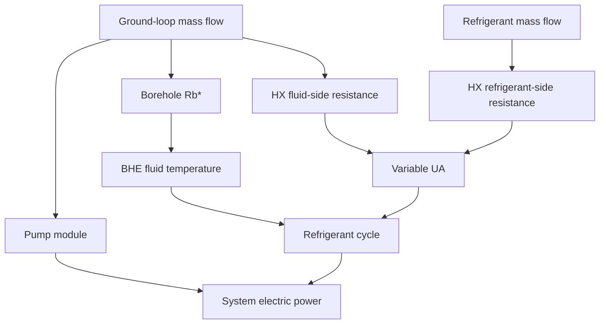

# TMHP GSHP 지중측 모델 개선 및 공통 물리모듈 리팩터링 계획

## 0. 목표

이번 작업은 단순히 GSHP 기능을 추가하는 것이 아니라, 향후 ASHP / GSHP / WSHP / HP boiler 계열에서 반복 사용할 물리모델을 공통 모듈로 분리하는 것을 포함한다.

핵심 목표:

1. **Multi-borehole g-function 열부하 정규화 수정**
2. **Generic heat-exchanger 모듈 분리**
3. **변유량 지중 순환펌프 모델 추가**
4. **유량에 따른 \(R_b^*\) 변화 반영**
5. **냉매·수측 질량유량에 따른 refrigerant–water HX의 \(UA\) 변화 반영**
6. GSHP / GSHPB에서 중복되는 ground-loop 계산 최소화
7. 기존 TMHP API와 결과의 backward compatibility 유지

기본 철학:

> System class는 시스템 구성과 제어를 담당하고, 반복 사용 가능한 물리식은 외부 공통 모듈이 담당한다.

---

# 1. 현재 구조 점검 및 분리 방향

## 1.1 반드시 분리할 것 — Generic heat exchanger

현재 HX 관련 계산이 여러 위치에 나뉘어 있음.

```text
enex_functions.py
  └ calc_HX_perf_for_target_heat()

hx_fan.py
  ├ calc_UA_from_dV_fan()
  └ calc_fan_power_from_dV_fan()

GSHP / GSHPB / WSHPB
  └ 각각 직접 NTU = UA / (m_dot cp) 계산
```

향후 다음 기능은 여러 모델에서 반복 사용 가능함.

- \(\varepsilon\)-NTU 계산
- fixed / variable UA
- secondary-fluid flow 변화
- refrigerant mass-flow 변화
- phase-change refrigerant ↔ single-phase fluid HX
- target heat duty에 필요한 secondary flow 계산

따라서 신규 공통 모듈 생성:

```text
src/tmhp/heat_exchanger.py
```

### 역할

```python
calc_phase_change_hx_effectiveness(...)
calc_phase_change_hx_capacity(...)
calc_UA_two_stream_scaled(...)
solve_secondary_flow_for_target_heat(...)
```

---

## 1.2 `heat_transfer.py`와 역할 구분

`heat_transfer.py`는 저수준 수식 / correlation 위주로 유지.

예:

```text
heat_transfer.py
  ├ LMTD
  ├ convection correlations
  ├ tank wall UA
  └ 기타 low-level heat-transfer correlations

heat_exchanger.py
  ├ UA scaling
  ├ resistance-network model
  ├ ε-NTU component equations
  └ target-duty HX solver
```

즉:

> `heat_transfer.py` = 수식 도구  
> `heat_exchanger.py` = 실제 HX component model

---

## 1.3 `hx_fan.py`는 fan-specific 역할만 유지

장기적으로:

```text
hx_fan.py
  └ calc_fan_power_from_dV_fan()
```

air-side UA scaling은 generic HX 구조에서 사용할 수 있도록 `heat_exchanger.py`로 이동 또는 wrapper 처리.

기존 API 보호를 위해:

```python
from .heat_exchanger import calc_UA_from_flow
```

형태로 re-export 가능.

---

# 2. 추가로 분리할 것 — Borehole physics

현재 `g_function.py` 안에는 서로 다른 두 물리가 함께 있음.

### A. Ground response
- finite line source
- g-function
- borefield geometry
- long-term thermal response

### B. Borehole internal resistance
- local \(R_b\)
- \(R_a\)
- multipole method
- effective \(R_b^*\)
- axial short-circuit correction

둘은 물리적으로 다른 영역이므로 분리 권장.

신규:

```text
src/tmhp/borehole.py
```

### `g_function.py`

```text
Ground → Borehole wall
```

담당.

### `borehole.py`

```text
Borehole wall → circulating fluid
```

담당.

이동 대상:

```python
calc_local_borehole_thermal_resistance(...)
calc_effective_borehole_thermal_resistance(...)
calc_effective_borehole_resistance_single_utube(...)
```

기존 `g_function.py`에서는 backward compatibility를 위해 re-export.

---

# 3. GSHP / GSHPB 공통 Ground-loop helper

현재 GSHP와 GSHPB에 다음 로직이 중복됨.

- \(N_b=N_1N_2\)
- borehole당 유량 계산
- total borehole length
- \(Q_{bhe}\rightarrow q'\)
- \(R_b^*\)
- fluid inlet / outlet temperature
- pump power
- g-function wall temperature와 fluid temperature 연결

따라서 신규 공통 helper 권장:

```text
src/tmhp/ground_loop.py
```

단, 거대한 class를 만들지 말 것.

### 1차 최소 역할

```python
calc_borehole_count(...)
calc_total_borehole_length(...)
calc_borehole_mass_flow(...)
calc_borefield_linear_load(...)
calc_bhe_fluid_temperatures(...)
```

추후:

```python
GroundLoopModel
```

로 발전 가능하지만 이번 단계에서 불필요한 객체화는 하지 않는다.

---

# 4. Pump / hydraulic 모듈

신규:

```text
src/tmhp/pump.py
```

## 역할

```python
calc_pipe_pressure_drop(...)
calc_parallel_borefield_pressure_drop(...)
calc_pump_power(...)
```

기존:

```python
heat_transfer.darcy_friction_factor(...)
```

는 pump/hydraulic 영역에 더 가까움.

### 선택지

이번 작업에서는 breaking change를 피하기 위해:

- 구현은 `pump.py`
- 기존 `heat_transfer.darcy_friction_factor()`는 wrapper / re-export 유지

---

# 5. 현재 더 분리하지 않아도 되는 부분

## 5.1 Compressor

이미 다음 모듈이 존재함.

```text
compressor_speed.py
compressor_envelope.py
refrigerant.py
```

따라서 이번 작업에서 compressor 관련 추가 구조변경은 하지 않는다.

다만 여러 system class에 반복되는 `_eval_eff()` / cycle assembly는 향후 별도 `compressor_model.py` 후보로 기록만 한다.

---

## 5.2 Dynamic simulation / tank control

이미:

```text
dynamic_context.py
dhw.py
stratified_tank.py
hybrid_tank.py
subsystems.py
```

로 분리되어 있음.

이번 GSHP 개선 범위에서 추가 리팩터링하지 않는다.

---

## 5.3 Exergy post-processing

ASHP / GSHP / boiler별 `postprocess_exergy()`에 중복은 존재하지만 물리 boundary가 모델별로 달라 공통화 난도가 높음.

이번 작업 범위에서는 유지.

향후 공통 helper 수준만 검토.

---

# 6. 권장 최종 모듈 구조

```text
src/tmhp/
│
├ refrigerant.py
├ compressor_speed.py
├ compressor_envelope.py
│
├ heat_transfer.py
├ heat_exchanger.py       # NEW: generic HX component physics
├ hx_fan.py               # fan-specific
│
├ pump.py                 # NEW: hydraulic + pump power
│
├ borehole.py             # NEW: local Rb / Rb* / multipole
├ g_function.py           # ground thermal response only
├ ground_coupling.py      # temporal superposition backend
├ ground_loop.py          # NEW: common GSHP/GSHPB field helper
│
├ air_source_heat_pump.py
├ air_source_heat_pump_boiler.py
├ ground_source_heat_pump.py
├ ground_source_heat_pump_boiler.py
├ water_source_heat_pump_boiler.py
│
├ dynamic_context.py
├ dhw.py
├ subsystems.py
└ ...
```

---

# Phase 1. Multi-borehole g-function 정규화 수정

## 문제

현재 borefield 전체 `Q_bhe [W]`를 다음처럼 처리:

\[
q' = \frac{Q_{bhe}}{H_b}
\]

Multi-borehole에서는:

\[
\boxed{
q' =
\frac{Q_{bhe}}
{N_bH_b}
}
\]

\[
N_b=N_1N_2
\]

## 수정 대상

- `ground_source_heat_pump.py`
- `ground_source_heat_pump_boiler.py`

공통 계산은 가능하면 `ground_loop.py`로 이동.

### helper

```python
def calc_borefield_linear_load(
    Q_bhe_total: float,
    n_boreholes: int,
    H_b: float,
) -> float:
    return Q_bhe_total / (n_boreholes * H_b)
```

## 중요

기존:

```python
self.Q_bhe = Q_bhe_unit * self.H_b
```

형태도 수정.

Field-total heat rate는:

\[
Q_{bhe,total}=q'N_bH_b
\]

이어야 함.

유체 온도변화:

\[
\Delta T_f =
\frac{Q_{bhe,total}}
{\dot m_{total}c_p}
\]

---

## Phase 1 tests

- \(N_b=1\): legacy result 유지
- \(N_b=4\), \(H=100\) m, \(Q=4000\) W → \(q'=10\) W/m
- `q_prime * N_b * H_b == Q_total`
- GSHP / GSHPB 동일 결과 규칙
- 동일 total load에서 \(N_b\) 증가 → \(q'\) 감소

---

# Phase 2. Heat-exchanger 공통 모듈 생성

## 신규

```text
src/tmhp/heat_exchanger.py
```

## 2.1 공통 ε-NTU 함수

Phase-change refrigerant 측은 근사적으로 \(C_r\rightarrow\infty\).

따라서 secondary single-phase fluid에 대해:

\[
NTU=\frac{UA}{\dot m c_p}
\]

\[
\varepsilon=1-e^{-NTU}
\]

\[
Q=
\varepsilon \dot m c_p
\left|T_{f,in}-T_{ref,sat}\right|
\]

이를 공통 함수로 분리.

```python
calc_phase_change_hx_effectiveness(...)
calc_phase_change_hx_capacity(...)
```

GSHP / GSHPB / WSHPB의 직접 NTU 계산을 이 helper로 교체.

---

## 2.2 Variable-UA resistance model

Rated point:

\[
R_{tot,0}=\frac{1}{UA_0}
\]

\[
\phi_f+\phi_r+\phi_c=1
\]

secondary-fluid side:

\[
R_f=
\frac{\phi_f}{UA_0}
\left(
\frac{\dot m_f}{\dot m_{f,0}}
\right)^{-n_f}
\]

refrigerant side:

\[
R_r=
\frac{\phi_r}{UA_0}
\left(
\frac{\dot m_r}{\dot m_{r,0}}
\right)^{-n_r}
\]

constant part:

\[
R_c=\frac{\phi_c}{UA_0}
\]

최종:

\[
\boxed{
UA=
\frac{1}{R_f+R_r+R_c}
}
\]

### 함수

```python
calc_UA_two_stream_scaled(
    UA_rated,
    m_dot_fluid,
    m_dot_fluid_rated,
    m_dot_ref,
    m_dot_ref_rated,
    fluid_fraction,
    refrigerant_fraction,
    constant_fraction,
    fluid_exponent,
    refrigerant_exponent,
)
```

---

## 2.3 적용 대상

1차:

- `GroundSourceHeatPump`
- `GroundSourceHeatPumpBoiler`
- `WaterSourceHeatPumpBoiler`

향후:

- tank refrigerant–water HX
- other liquid-source HP models

Air-side 모델도 장기적으로 동일 interface 사용 가능.

---

## 2.4 기존 API

`enex_functions.calc_HX_perf_for_target_heat()`는 즉시 삭제하지 않는다.

실제 구현을 `heat_exchanger.py`로 이동하고 기존 위치에서는 re-export / wrapper.

---

# Phase 3. Pump 모듈 및 변유량

## 신규

```text
src/tmhp/pump.py
```

Boreholes는 동일 병렬 branch 가정.

\[
\dot m_b=
\frac{\dot m_{total}}{N_b}
\]

Single U-tube:

\[
L_b\approx2H_b
\]

\[
v_b=
\frac{\dot m_b}{\rho A_p}
\]

\[
\Delta p_b=
f\frac{L_b}{D}
\frac{\rho v_b^2}{2}
\]

\[
\boxed{
E_{pmp}=
\frac{
(\Delta p_b+\Delta p_{common})\dot V_{total}
}{
\eta_{pmp}
}
}
\]

---

## Header simplification

상세 header / manifold network는 구현하지 않는다.

기본:

\[
\boxed{\Delta p_{common}=0}
\]

optional:

```python
dp_common=0.0
```

TMHP는 hydraulic design tool이 아니라 system thermodynamic model임을 명확히 문서화.

---

# Phase 4. Borehole resistance 모듈 분리

## 신규

```text
src/tmhp/borehole.py
```

이동:

```python
calc_local_borehole_thermal_resistance(...)
calc_effective_borehole_thermal_resistance(...)
```

역할 구분:

```text
g_function.py
Ground → borehole wall

borehole.py
Borehole wall → fluid
```

---

# Phase 5. Variable \(R_b^*\)

\[
\boxed{
R_b^*=f(\dot m_b)
}
\]

\[
\dot m_b=
\frac{\dot m_{total}}{N_b}
\]

매 timestep multipole solve 금지.

초기화 시 flow grid 계산:

```text
0.2
0.3
...
1.2 × rated flow
```

각 점에서 `borehole.py`의 resistance 함수 사용 후 interpolation.

```python
self._rb_eff_interp(m_flow_borehole)
```

---

# Phase 6. Ground-loop 공통 helper 적용

신규:

```text
src/tmhp/ground_loop.py
```

최소 함수:

```python
calc_borehole_count(...)
calc_total_borehole_length(...)
calc_borehole_mass_flow(...)
calc_borefield_linear_load(...)
calc_bhe_fluid_temperatures(...)
```

GSHP / GSHPB가 각각 같은 수식을 구현하지 않도록 함.

---

# Phase 7. Variable-flow coupling

하나의 \(\dot m_w\)가 모든 관련 물리에 전달되어야 함.



즉:

\[
\dot m_w\rightarrow E_{pmp}
\]

\[
\dot m_w\rightarrow R_b^*
\]

\[
(\dot m_w,\dot m_r)\rightarrow UA
\]

가 같은 operating point에서 계산되어야 함.

---


---

# Phase 7.5. 최적 변유량 제어 — Compressor + Pump Power 최소화

## 목적

Variable-flow mode에서는 PLR에 유량을 단순 비례시키지 않는다.  
각 운전점에서 ground-loop mass flow를 최적화 변수로 두고 다음 목적함수를 최소화한다.

\[
\boxed{
\dot m_w^*
=
\arg\min_{\dot m_{w,\min}\le \dot m_w\le \dot m_{w,\max}}
\left(E_{cmp}+E_{pmp}\right)
}
\]

즉 **압축기 전력 절감과 펌프 전력 증가 사이의 trade-off**를 직접 계산해 최적 유량을 선택한다.

## 물리적 의미

### Low flow
- \(E_{pmp}\) 감소
- water-side convection 감소
- \(UA\) 감소 가능
- \(R_b^*\) 증가 가능
- source-side temperature approach 악화
- refrigerant lift / pressure ratio 증가 가능
- \(E_{cmp}\) 증가 가능

### High flow
- water-side conductance 증가
- \(UA\) 및 heat-transfer capability 증가
- \(R_b^*\) 감소 가능
- source-side approach 개선
- compressor lift 감소 가능
- \(E_{cmp}\) 감소 가능
- 그러나 \(\Delta p\) 및 \(E_{pmp}\) 증가

따라서 목표는 중간 어딘가의

\[
\boxed{E_{cmp}+E_{pmp}=\min}
\]

이 되는 유량을 찾는 것이다.

> 주의: 유량 증가 시 \(UA\)와 열전달 가능량은 증가할 수 있으나 HX effectiveness \(\varepsilon\)가 반드시 증가하는 것은 아니다.  
> Phase-change refrigerant / single-phase water 근사에서
>
> \[
> NTU=\frac{UA}{\dot m_wc_p},\qquad
> \varepsilon=1-e^{-NTU}
> \]
>
> 이므로 \(UA\propto\dot m_w^n,\;n<1\)이면 유량 증가 시 NTU와 \(\varepsilon\)가 감소할 수도 있다.  
> 논문에서는 “higher flow increases HX conductance / heat-transfer capability and can reduce the required refrigerant-side approach temperature”로 표현한다.

## 최적화 변수

권장 normalized variable:

\[
f_w=
\frac{\dot m_w}{\dot m_{w,rated}}
\]

입력:

```python
ground_flow_min_ratio
ground_flow_max_ratio
```

예:

```text
0.2 <= f_w <= 1.2
```

실제 default 범위는 문헌 및 장비 가정에 따라 별도 확정한다.

## Candidate flow마다 갱신할 물리량

```text
candidate flow
    ↓
borehole branch flow
    ↓
Rb*(flow)
    ↓
ground-loop fluid temperature

candidate flow
    ↓
pressure drop
    ↓
pump power

candidate flow + refrigerant mass flow
    ↓
variable UA
    ↓
HX feasibility / approach
    ↓
compressor speed & compressor power

objective = E_cmp + E_pmp
```

즉 한 candidate \(\dot m_w\)마다 반드시 다음을 같은 operating point에서 다시 계산한다.

1. \(\dot m_b=\dot m_w/N_b\)
2. \(R_b^*(\dot m_b)\)
3. \(\Delta p(\dot m_w)\)
4. \(E_{pmp}(\dot m_w)\)
5. refrigerant cycle / \(\dot m_r\)
6. \(UA(\dot m_w,\dot m_r)\)
7. HX capacity / approach constraint
8. compressor speed
9. \(E_{cmp}\)
10. \(E_{cmp}+E_{pmp}\)

## 제약조건

- \(\dot m_{min}\le\dot m_w\le\dot m_{max}\)
- requested load 만족
- compressor min/max speed
- pressure-ratio envelope
- dynamic-UA 기준 HX feasibility
- CoolProp valid state
- no NaN / zero-flow division / negative power

Infeasible candidate는 `np.inf` 또는 충분히 큰 penalty로 처리한다.

## 수치해석 구조

### Nested optimization 권장

현재 solver 구조를 최대한 유지한다.

#### GroundSourceHeatPump

```text
Outer:
    ground-flow ratio optimization

Inner:
    기존 dT_evap / dT_cond optimization
    + compressor speed solve
```

#### GroundSourceHeatPumpBoiler

```text
Outer:
    ground-flow ratio optimization

Inner:
    기존 brentq(dT_ground)
    + compressor speed solve
```

ground-flow ratio는 1D bounded variable이므로 우선:

```python
scipy.optimize.minimize_scalar(
    objective,
    bounds=(ground_flow_min_ratio, ground_flow_max_ratio),
    method="bounded",
)
```

사용.

수렴 실패 시 coarse grid search fallback을 둘 수 있다.

## Control API

```python
ground_flow_control: str = "constant"
```

허용:

```text
"constant"
"optimal_power"
```

### constant

\[
\dot m_w=\dot m_{w,rated}
\]

유량 최적화는 실행하지 않는다.

### optimal_power

\[
\dot m_w^*
=
\arg\min(E_{cmp}+E_{pmp})
\]

향후 확장 후보:

```text
"plr"
"delta_t"
```

이번 연구의 variable-flow는 `optimal_power`를 의미한다.

## Pump physics와 flow control 분리

반드시 다음을 분리한다.

```text
pump.py
    m_dot -> pressure drop -> pump power

ground_loop.py / control helper
    operating point -> selected m_dot
```

`ConstantFlowPump`, `VariableFlowPump` 클래스를 별도로 만들지 않는다.  
동일 pump physics를 사용하고 **control policy만 다르게** 한다.

## 저장 결과

```text
ground_flow_control
ground_flow_ratio
dV_bhe_f [m3/s]
m_dot_borehole [kg/s]
R_b_eff [mK/W]
UA_ground [W/K]
E_cmp [W]
E_pmp [W]
E_cmp_plus_pmp [W]
flow_optimizer_success
flow_optimizer_nfev
flow_bound_active
```

## 검증 Figure

### Figure A — Power trade-off vs flow

대표 PLR 2–3개에서:

- x: ground-flow ratio
- y:
  - \(E_{cmp}\)
  - \(E_{pmp}\)
  - \(E_{cmp}+E_{pmp}\)
- optimum marker

### Figure B — Optimal flow vs PLR

- x: PLR
- y: optimal ground-flow ratio
- constant-flow = 1.0 horizontal baseline

### Figure C — COP comparison

- compressor COP
- system COP
- constant-flow vs optimal-flow

이 Figure 중 최종 1-page 논문에는 1~2개만 선택한다.


---

# Phase 7.6. HX 용량 부족 및 infeasible operating point 처리

## 목적

Variable-flow 최적화에서는 모든 ground-loop flow candidate가 물리적으로 가능한 것은 아니다.

사용자가 설정한:

- rated \(UA_{ground}\)
- ground-loop flow range
- refrigerant-side flow / compressor operating point
- source temperature
- borefield condition
- requested load

의 조합에 따라 refrigerant–water HX가 요구 열량을 전달하지 못할 수 있다.

따라서 최적화는:

> **전력 최소화 이전에 heat-transfer feasibility를 먼저 만족해야 한다.**

---

## 1. HX feasible condition

Phase-change refrigerant / single-phase ground-water HX에 대해:

\[
C_w=\dot m_wc_p
\]

\[
NTU=
\frac{UA(\dot m_w,\dot m_r)}
{C_w}
\]

\[
\varepsilon=
1-\exp(-NTU)
\]

\[
Q_{HX}
=
\varepsilon C_w
\left|T_{w,in}-T_{ref,sat}\right|
\]

냉매 cycle이 요구하는 열량:

\[
Q_{ref}
\]

에 대해 정상상태 feasible condition은:

\[
\boxed{
Q_{HX}=Q_{ref}
}
\]

inner approach-temperature solver가 위 조건을 만족하는 해를 찾아야 한다.

---

## 2. HX capacity 부족 판정

허용 가능한 refrigerant-side approach range:

\[
\Delta T_{app,min}
\le
\Delta T_{app}
\le
\Delta T_{app,max}
\]

내에서 다음 residual을 정의:

\[
F(\Delta T_{app})
=
Q_{ref}-Q_{HX}
\]

### feasible

허용 범위 안에:

\[
F=0
\]

root가 존재함.

### infeasible — HX capacity 부족

허용 가능한 최대 heat-transfer condition에서도:

\[
Q_{HX,\max}
<
Q_{ref}
\]

이면 해당 flow candidate는 불가능.

예:

```text
requested / refrigerant-side duty = 8.0 kW
HX maximum transferable heat      = 6.7 kW

→ infeasible
→ optimizer candidate에서 제외
```

---

## 3. Flow optimizer에서의 처리

Outer objective는 단순:

\[
E_{cmp}+E_{pmp}
\]

가 아니라 feasibility-aware objective로 구현.

개념:

```python
def objective(flow_ratio):
    result = solve_operating_point(flow_ratio)

    if not result["hx_feasible"]:
        return np.inf

    if not result["cycle_feasible"]:
        return np.inf

    return result["E_cmp [W]"] + result["E_pmp [W]"]
```

또는 finite penalty 사용 가능하나,
가능하면 **invalid state와 valid but inefficient state를 명확히 구분**하기 위해 `np.inf` 또는 explicit feasibility flag 권장.

---

## 4. 전체 flow range가 infeasible한 경우

사용자가 입력한:

```text
ground_flow_min_ratio
ground_flow_max_ratio
UA_ground_rated
borefield condition
requested load
```

조합에서 모든 candidate가 infeasible할 수 있다.

이 경우 optimizer가 임의의 경계값을 반환해서는 안 된다.

반드시 simulation result에:

```text
converged = False
failure_reason = "ground_hx_capacity_insufficient"
hx_feasible = False
```

등의 명확한 diagnostic을 반환.

그리고:

- compressor power
- pump power
- COP

를 정상 운전값처럼 사용하지 말 것.

---

## 5. Capacity-clamped 운전과 구분

두 경우를 반드시 구분.

### A. Compressor capacity limit

```text
failure / clamp reason:
compressor_min_speed
compressor_max_speed
pressure_ratio_limit
```

### B. HX heat-transfer limit

```text
failure reason:
ground_hx_capacity_insufficient
```

즉:

> 압축기가 열량을 못 내는 것과  
> HX가 그 열량을 전달하지 못하는 것은 다른 물리적 원인.

diagnostic에서 분리해야 한다.

---

## 6. Optimization sequence

각 candidate ground-loop flow에 대해 다음 순서로 평가:

```text
1. ground-loop flow candidate
2. pump pressure drop / power
3. borehole flow
4. Rb*(flow)
5. source-fluid inlet temperature
6. refrigerant approach guess
7. refrigerant cycle solve
8. refrigerant mass flow
9. UA(m_water, m_ref)
10. ε-NTU HX capacity
11. check Q_HX vs Q_ref
12. approach root solve
13. HX feasible?
14. compressor constraints feasible?
15. compute E_cmp
16. objective = E_cmp + E_pmp
```

### 핵심

**Step 13 이전에는 해당 candidate를 정상 operating point로 취급하지 않는다.**

---

## 7. 입력변수 사전 점검

Simulation 시작 전에 최소한 다음 sanity check를 수행.

### Positive inputs

```text
UA_ground_rated > 0
m_dot_ground_rated > 0
pump_efficiency > 0
H_b > 0
N_b >= 1
```

### Flow bounds

```text
0 < ground_flow_min_ratio < ground_flow_max_ratio
```

### Resistance fractions

\[
\phi_w+\phi_r+\phi_c=1
\]

### Optional pre-screen

Rated condition에서:

\[
Q_{HX,rated,max}
\]

를 계산해 정격 부하와 비교.

명백히 부족하면 simulation 시작 전 warning 또는 error.

단, dynamic operating condition에서 feasibility는 다시 판단해야 함.

---

## 8. 저장할 diagnostic 변수

결과 CSV에 추가:

```text
hx_feasible
Q_HX_available [W]
Q_ref_required [W]
hx_capacity_margin [W]
hx_capacity_ratio
failure_reason
approach_solver_success
approach_at_bound
```

정의:

\[
\text{hx capacity margin}
=
Q_{HX,available}-Q_{ref,required}
\]

\[
\text{hx capacity ratio}
=
\frac{Q_{HX,available}}
{Q_{ref,required}}
\]

---

## 9. Validation plot 추가

### HX feasibility map

권장:

- x: PLR
- y: ground-flow ratio
- color:
  - \(Q_{HX,available}/Q_{ref,required}\)

기준선:

\[
Q_{HX}/Q_{ref}=1
\]

- >1: feasible margin
- =1: limiting boundary
- <1: infeasible

이 그림은 개발 검증용으로 우선 사용하고,
1-page 논문에는 공간이 부족하면 제외.

---

## 10. 논문 작성 시 주의

논문 결과는 **feasible operating points만 사용**한다.

만약 특정 PLR / flow 영역이 infeasible하면 이를 숨기지 말고:

- 해당 영역 제외 이유
- HX capacity limit
- optimizer가 선택 가능한 flow domain

을 짧게 명시.

모델이 임의로 load를 만족한 것처럼 보이게 하지 말 것.


# Phase 8. GSHP 입력 / backward compatibility

신규 예:

```python
variable_ground_flow: bool = False
variable_ground_hx_UA: bool = False
variable_Rb: bool = False

pump_efficiency: float = ...
pipe_inner_diameter: float = ...
pipe_roughness: float = ...
dp_common: float = 0.0
ground_flow_min_ratio: float = ...
```

기존:

```python
E_pmp
dV_b_f_lpm
UA_ground
```

입력은 유지.

### Legacy mode

```text
fixed flow
fixed E_pmp
fixed UA
fixed Rb*
```

에서는 기존 결과 유지.

---

# Phase 9. Validation figures

## Figure 1 — Multi-borehole normalization

- x: \(N_b\)
- y: \(q'\)
- fixed total \(Q_{bhe}\), \(H\)

\[
q'\propto1/N_b
\]

---

## Figure 2 — Pump power vs ground-loop flow

- x: \(\dot m/\dot m_{rated}\)
- y: \(E_{pmp}/E_{pmp,rated}\)
- \(H=50/100/200\) m

---

## Figure 3 — \(R_b^*\) vs borehole flow

- x: \(\dot m_b/\dot m_{b,rated}\)
- y: \(R_b^*\)
- multiple \(H\)

---

## Figure 4 — Variable UA map

- x: water-flow ratio
- y: refrigerant-flow ratio
- color: \(UA/UA_0\)

Heatmap 형태 권장.

---

## Figure 5 — PLR–COP

기존 vs 개선:

- compressor COP
- system COP

\[
COP_{sys}
=
\frac{Q}
{E_{cmp}+E_{pmp}+E_{fan}}
\]

---

# Phase 10. 테스트

## Heat exchanger

- rated flow → `UA == UA_rated`
- fluid flow 감소 → UA 감소
- refrigerant flow 감소 → UA 감소
- resistance fractions sum != 1 → error
- zero / negative flow guard

## Pump

- \(H\) 증가 → pressure drop 증가
- 동일 branch flow에서 \(2H\) scaling 확인
- \(N_b\) 병렬 시 branch flow = total / \(N_b\)
- `dp_common=0` default 확인

## Borehole

- fixed flow에서 legacy \(R_b^*\) 재현
- flow 증가 → physically consistent \(R_b^*\) trend
- interpolation vs direct calculation error 확인

## Ground loop

- total ↔ per-length heat rate round-trip
- GSHP / GSHPB 같은 geometry에서 동일 ground helper result

---

# 구현 순서

```text
0. 공통 모듈 구조 먼저 생성
   ├ heat_exchanger.py
   ├ borehole.py
   ├ pump.py
   └ ground_loop.py

1. q' = Q/(Nb H) bug fix + regression test

2. 기존 HX NTU 계산을 heat_exchanger.py로 이동
   └ 결과 변화 없어야 함

3. borehole resistance를 g_function.py에서 borehole.py로 이동
   └ 기존 API re-export

4. pump.py 추가
   └ fixed-flow legacy mode 유지

5. variable Rb*(flow)

6. variable UA(m_water, m_ref)

7. GSHP / GSHPB 통합

8. WSHPB에도 generic liquid-HX helper 적용

9. validation / plots
```

---

# 이번 작업에서 하지 않을 리팩터링

아래는 후보이나 이번 scope에서는 제외.

### Compressor model 통합
- `_eval_eff`
- refrigerant-cycle assembly
- compressor power assembly

이미 `compressor_speed.py`, `compressor_envelope.py`, `refrigerant.py`가 있으므로 추후 별도 작업.

### Generic operating-point optimizer
ASHP / GSHP / boiler별 decision variable이 달라 현재 통합 시 abstraction cost가 큼.

### Exergy postprocessor 완전 통합
각 모델 boundary가 달라 추후 별도 검토.

---

# 금지 사항

- system class 내부에 새로운 물리식을 길게 직접 구현하지 말 것
- 상세 HX geometry를 필수 입력으로 만들지 말 것
- 상세 header/manifold hydraulic network를 구현하지 말 것
- pump pressure drop을 \(N_b\)개 borehole의 직렬합으로 계산하지 말 것
- multi-borehole \(R_b^*\)를 field-total thermal resistance로 해석하지 말 것
- g-function과 borehole internal resistance 역할을 혼합하지 말 것
- 기존 public function을 즉시 삭제하지 말 것
- 리팩터링과 물리모델 변경을 한 commit에서 동시에 검증하지 말 것

---

# 완료 기준

- [ ] `heat_exchanger.py` 생성
- [ ] generic ε-NTU 함수 이동
- [ ] two-stream variable-UA model 구현
- [ ] 기존 HX API wrapper 유지
- [ ] `borehole.py` 생성
- [ ] \(R_b\), \(R_b^*\) 계산 이동
- [ ] `pump.py` 생성
- [ ] `ground_loop.py` 생성
- [ ] GSHP / GSHPB multi-borehole normalization 수정
- [ ] GSHP / GSHPB 중복 ground-loop 계산 감소
- [ ] variable-flow pump 구현
- [ ] `ground_flow_control="constant" | "optimal_power"` 선택 가능
- [ ] optimal-power mode에서 \(E_{cmp}+E_{pmp}\) 최소화
- [ ] 대표 PLR에서 objective-vs-flow 곡선으로 optimum 검증
- [ ] \(R_b^*(\dot m_b)\) 구현
- [ ] \(UA(\dot m_w,\dot m_r)\) 구현
- [ ] WSHPB에서 generic liquid-HX helper 재사용 확인
- [ ] legacy regression test 통과
- [ ] Figure 1–5 생성
- [ ] docs에 각 모듈 boundary와 assumptions 기록

---

# Phase 11. 변유량 GSHP 모델 기반 1-page 논문 작성

## 목적

본 개발 완료 후 개선된 variable-flow GSHP 모델을 사용하여 **1-page 학술발표용 논문**을 작성한다.

첨부된 한국지열·수열에너지학회 1-page 서식을 **형식만 참고**하고, 이후 agent가 제공된 HWPX 원본을 직접 수정한다.

### 작성 방향

논문의 목적은 상세 validation paper가 아니라:

> **카탈로그 기반 범용 물리모델에서 최소 입력으로 variable-flow GSHP의 주요 물리 거동을 재현할 수 있음을 보여주는 것**

으로 설정한다.

핵심 메시지는 기존 TMHP 개발 철학과 연결한다.

1. 기존 building simulation의 regression-based heat-pump model은 내부 열역학 상태 및 운전변수 해석에 한계가 있음
2. 반대로 detailed physical model은 HX geometry, 배관망, compressor map 등 과도한 입력을 요구할 수 있음
3. TMHP는 그 중간 지점으로,
   - 제조사 catalog 수준 입력
   - simplified physics-based submodels
   - component-level physical interpretation
   을 목표로 함
4. 본 연구에서는 이를 GSHP의
   - variable ground-loop flow
   - pump power
   - \(R_b^*(\dot m)\)
   - \(UA(\dot m_w,\dot m_r)\)
   로 확장함

---

## 11.1 논문 범위

### 포함

- variable-flow GSHP model architecture
- simplified hydraulic model
- flow-dependent \(R_b^*\)
- flow-dependent refrigerant–water HX \(UA\)
- PLR에 따른 주요 model behavior
- compressor COP / system COP 차이

### 제외

- 상세 hydraulic network validation
- header / manifold network
- detailed HX geometry
- detailed CFD / pipe-network simulation
- 장기 field measurement validation
- 과도한 parameter sensitivity
- exergy analysis 확장

> 1-page 논문이므로 “모델의 동작과 개발 의의”에 집중한다.

---

## 11.2 권장 제목 방향

### 국문 후보

**변유량 지열히트펌프의 물리 기반 부분부하 모델링**

또는

**카탈로그 기반 변유량 지열히트펌프 물리 모델 개발**

또는

**유량 의존 열교환 및 펌프 모델을 고려한 지열히트펌프 모델 개발**

### 영문 후보

**Physics-Based Part-Load Modeling of a Variable-Flow Ground Source Heat Pump**

또는

**Development of a Catalogue-Based Variable-Flow Ground Source Heat Pump Model**

최종 제목은 결과가 나온 뒤 선택한다.

---

## 11.3 1-page 전체 구성

첨부 HWPX 형식을 유지.

```text
Title
Authors / Affiliations

Extended Abstract
  ① Background / limitation
  ② TMHP modeling philosophy
  ③ Proposed variable-flow GSHP model
  ④ Simulation condition
  ⑤ Main result

Figure(s)

Results and Discussions
  • Result 1
  • Result 2

Acknowledgement
```

본문 분량은 첨부 예시 수준을 넘기지 않는다.

---

# 11.4 Extended Abstract 내러티브

## Paragraph 1 — 필요성

핵심 논리:

```text
기존 regression model
→ 빠르고 입력이 적음
→ 내부 thermodynamic behavior 해석 어려움

Detailed physical model
→ 물리적 설명력 높음
→ HX geometry / pipe network / compressor data 등 입력 과다

TMHP
→ catalogue-level input과 reduced-order physics의 중간 접근
```

### 반드시 포함할 의미

- GSHP의 부분부하 성능은 compressor만이 아니라
  - ground-loop flow
  - pump power
  - borehole resistance
  - refrigerant–water HX conductance
  와 함께 변화
- 이를 모두 고정값으로 두면 variable-flow GSHP의 시스템 거동을 해석하기 어려움

---

## Paragraph 2 — 모델

짧게 아래만 설명.

### Ground response

\[
q'=
\frac{Q_{bhe}}
{N_bH_b}
\]

g-function을 통해 borehole-wall temperature 계산.

### Borehole

\[
R_b^*=f(\dot m_b)
\]

### Pump

\[
E_{pmp}
=
\frac{\Delta p\,\dot V}
{\eta_{pmp}}
\]

Borehole branch pressure loss만 모델링.

Header / manifold loss는 단순화를 위해 제외.

### Refrigerant–water HX

\[
UA=f(\dot m_w,\dot m_r)
\]

rated-UA 기반 resistance model 사용.

상세 HX geometry는 요구하지 않음.

---

# 11.5 Simulation case

논문용 case는 복잡하게 만들지 않는다.

## 기본

- 동일 borefield / building-side condition
- 동일 refrigerant
- 동일 rated capacity
- PLR sweep
- variable ground-loop flow 적용

### 비교

```text
Case A — constant-flow model
Case B — optimal variable-flow model (\(E_{cmp}+E_{pmp}\) minimum)
```

필요 시:

```text
Case C — variable flow + variable UA + variable Rb*
```

까지 추가하되 그림 가독성이 떨어지면 A/B만 사용.

---

# 11.6 Figure 구성

1-page이므로 **최대 2개 Figure**만 사용.

## 권장안 A — 2개 Figure, 2열 배치

### Fig. 1 — Model behavior

2개의 subplot:

**(a) Ground-loop flow / pump power vs PLR**

- x: PLR
- left y: \(\dot m_w/\dot m_{w,rated}\)
- right y 또는 동일 plot: \(E_{pmp}\)

**(b) \(UA/UA_0\) and \(R_b^*/R_{b,0}^*\) vs PLR**

목적:

> variable flow가 실제 submodel parameter를 어떻게 변화시키는지 보여줌.

---

### Fig. 2 — COP behavior

2개의 subplot:

**(a) Compressor COP vs PLR**

\[
COP_{comp}=
\frac{Q}{E_{cmp}}
\]

**(b) System COP vs PLR**

\[
COP_{sys}=
\frac{Q}
{E_{cmp}+E_{pmp}+E_{fan}}
\]

Fixed-flow vs variable-flow 비교.

목적:

> pump 및 HX/BHE 변화가 component COP와 system COP에 어떻게 전달되는지 보여줌.

---

## 권장안 B — Figure 1개만 사용할 경우

4-panel compact figure:

```text
(a) flow ratio
(b) pump power
(c) variable UA / Rb*
(d) compressor COP / system COP
```

단, 첨부 서식처럼 2열 그림을 사용하는 편이 가독성 측면에서 우선.

---

# 11.7 Results and Discussions

첨부 예시와 같이 bullet 2개 정도만 사용.

### 결과 1 — variable-flow component behavior

예:

> **지중루프 유량 변화:** 부분부하 운전에서 지중루프 유량 감소에 따라 펌프 소비전력이 감소했으며, 동시에 \(R_b^*\)와 냉매–물 열교환기 \(UA\)가 변하였다.

### 결과 2 — COP behavior

예:

> **시스템 COP 변화:** 압축기 COP와 시스템 COP의 부분부하 거동에 차이가 나타났으며, 이는 압축기 효율뿐 아니라 펌프 소비전력과 유량 의존 열교환 특성이 시스템 성능에 함께 영향을 주기 때문이다.

실제 수치와 방향은 simulation 결과 확인 후 작성하며 미리 단정하지 않는다.

---

# 11.8 논문에서 강조할 contribution

최종 원고에서는 아래 3가지만 명확히 전달.

### 1. Reduced-order physics

상세 geometry 없이:

\[
\dot m
\rightarrow
E_{pmp}, R_b^*, UA
\]

를 물리적으로 연결.

### 2. Catalogue-oriented model

상세 설계정보 대신:

- rated capacity
- rated flow
- rated UA
- borehole geometry
- minimum hydraulic parameters

수준으로 모델 구성.

### 3. Component-level interpretation

단순 COP만 출력하는 regression model과 달리:

- water flow
- pump power
- \(R_b^*\)
- \(UA\)
- compressor power
- compressor COP
- system COP

를 동시에 해석 가능.

---

# 11.9 HWPX 수정 작업 지침

작업 완료 후 agent에게 다음 파일 제공:

```text
첨부 HWPX template
최종 simulation figures
최종 result CSV
본 plan MD
```

Agent는:

1. 첨부 HWPX의 page size / margin / font / heading / caption style 유지
2. 기존 논문 내용은 모두 새 연구내용으로 교체
3. **1 page 유지**
4. Figure는 1개 또는 최대 2개
5. 2개일 경우 첨부 예시처럼 2열 배치 우선
6. 표는 가능하면 사용하지 않음
7. 긴 수식 유도는 넣지 않음
8. 모델 상세는 핵심 식 2–4개만 본문에 포함
9. Results and Discussions는 bullet 2개 정도
10. 실제 simulation 결과에 없는 수치나 결론을 생성하지 않음
11. Acknowledgement는 **2025년 과제만 유지**하고 2023년 과제번호는 삭제

### Acknowledgement 고정 문구

```text
이 성과는 정부(과학기술정보통신부)의 재원으로 한국연구재단의 지원을 받아 수행된 연구임(No. RS-2025-00512551).
```

---

# 11.10 논문 작성 완료 기준

- [ ] HWPX 원본 서식 유지
- [ ] 1 page 유지
- [ ] 기존 regression model의 한계 설명
- [ ] detailed physical model의 과도한 입력 문제 설명
- [ ] TMHP의 catalogue-based reduced-order physics 철학 명시
- [ ] variable-flow GSHP 개선사항 설명
- [ ] \(q'=Q/(N_bH)\) 반영
- [ ] \(E_{pmp}(\dot m)\) 반영
- [ ] \(R_b^*(\dot m)\) 반영
- [ ] \(UA(\dot m_w,\dot m_r)\) 반영
- [ ] Figure 1–2 이내
- [ ] compressor COP / system COP 구분
- [ ] 결과 bullet 2개 수준
- [ ] 실제 simulation 결과와 원고 수치 일치
- [ ] 논문 내 최소 simulation / operating conditions 명시
- [ ] Acknowledgement는 `No. RS-2025-00512551`만 유지
- [ ] PDF export 후 1-page layout 최종 확인

---


---

# Phase 11 보완. 논문에 필수 운전조건 명시

1-page 논문에서도 결과의 재현성과 해석을 위해 **최소 simulation / operating conditions를 반드시 명시**한다.

## 권장 표시 방식

공간이 허용되면 Figure 위에 매우 작은 2열 표를 사용:

### Table 1. Simulation conditions

| Parameter | Value |
|---|---|
| Refrigerant | 최종 사용 냉매 |
| Rated capacity | 최종 정격용량 |
| Borefield | \(N_1\times N_2\), \(B\), \(H_b\) |
| Ground | \(T_g\), \(k_s\) |
| Ground-loop rated flow | \(\dot m_{w,rated}\) |
| Flow range | \(f_{w,min}\)–\(f_{w,max}\) |
| Pump efficiency | \(\eta_{pmp}\) |
| Rated ground HX UA | \(UA_{ground,rated}\) |
| Load condition | PLR sweep |
| Load-side condition | 실내온도 또는 tank temperature |

1-page 공간이 부족하면 표 대신 Extended Abstract 마지막 1–2문장에 위 조건 중 핵심값을 압축해서 작성한다.

### 반드시 포함할 최소 항목

- refrigerant
- rated capacity
- borefield \(N_1\times N_2\)
- borehole depth \(H_b\)
- borehole spacing \(B\)
- undisturbed ground temperature \(T_g\)
- ground thermal conductivity \(k_s\)
- rated ground-loop flow
- variable-flow lower / upper bounds
- pump efficiency
- rated \(UA_{ground}\)
- PLR range
- load-side temperature condition

### 원칙

- 논문 Figure 결과에 사용한 실제 값만 입력
- 아직 결정되지 않은 값은 임의로 만들지 말 것
- 상세 pipe / grout parameter는 본문 공간이 부족하면 생략 가능
- 상세 parameter set은 TMHP 코드 / supplementary material로 남기고 1-page에는 핵심 운전조건만 표시


# 전체 최종 Phase 순서

```text
Phase 0  공통 모듈 구조 생성

Phase 1  Multi-borehole normalization 수정
Phase 2  Generic heat_exchanger.py
Phase 3  Variable-flow pump.py
Phase 4  borehole.py 분리
Phase 5  Variable Rb*(flow)
Phase 6  ground_loop.py 공통화
Phase 7  Variable-flow coupling
Phase 8  GSHP API / backward compatibility
Phase 9  Validation figures
Phase 10 Regression / physical consistency tests

Phase 11  1-page 학술논문 작성
          ├ simulation case 확정
          ├ Figure 1–2 생성
          ├ Extended Abstract 작성
          ├ Results and Discussions 작성
          └ 첨부 HWPX template에 반영
```
