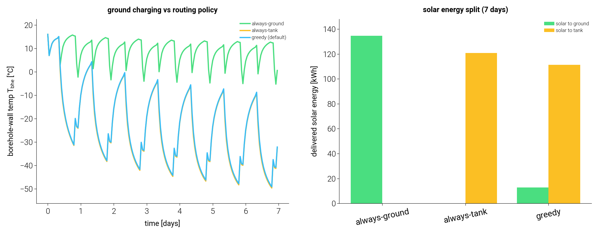

# Per-timestep solar routing — ground vs tank

`GSHPB_STC_routed` unifies the two solar scenarios (`GSHPB_STC_ground`,
`GSHPB_STC_tank`) into one model that routes the collected solar heat to the
borehole field **or** the storage tank **each timestep**, exclusively (never
both). The routing decision is a control input — a callable `solar_router`
evaluated every step — so it is a natural per-timestep **decision variable for an
MPC**.

## Why one model with a router

The two destinations enter the dynamic solve through different couplings, so a
single class gates each per step:

| route    | coupling                                   | effect                          |
| -------- | ------------------------------------------ | ------------------------------- |
| `tank`   | net `Q_STC` in the tank energy balance     | DHW preheat now                 |
| `ground` | solar heat subtracted from the HP ground load before borehole superposition | seasonal source charging (COP later) |
| `off`    | neither — reduces to the base GSHPB        | —                               |

Exclusivity is structural: the router returns a single destination, so ground and
tank are never charged on the same step. The chosen destination is still gated by
a net-heat-gain feasibility check (collector outlet hotter than that sink),
falling back to `off` if infeasible.

```python
from tmhp import GSHPB_STC_routed, default_solar_router

# default greedy policy: tank when below setpoint, else ground
model = GSHPB_STC_routed(stc=stc, ref="R32", T_tank_w_lower_bound=60.0)

# or supply your own per-step decision (e.g. an MPC output)
model = GSHPB_STC_routed(stc=stc, solar_router=lambda *, T_tank_w, T_bhe, **_:
                         "tank" if T_tank_w < 60 else "ground")
```

The router signature exposes the step state an MPC would branch on
(`hour_of_day`, `T_tank_w`, `T_tank_lower`, `T_bhe`, `T0`); unused keys are
accepted so a custom router never breaks on signature drift.

## Experiment — three policies, 7-day diurnal run

`compare_routing_policies.py` runs the same 7-day schedule (diurnal sun + morning/
evening DHW draws) under three policies on a small 2×1 borehole field.



| policy        | solar→ground [kWh] | solar→tank [kWh] | T_bhe mean [°C] | T_bhe min [°C] | T_bhe end [°C] |
| ------------- | ------------------ | ---------------- | --------------- | -------------- | -------------- |
| always-ground | 134.7              | 0.0              | **+9.0**        | −5.3           | **+0.6**       |
| always-tank   | 0.0                | 120.9            | −23.4           | −49.7          | −32.6          |
| greedy        | 12.8               | 111.3            | −22.8           | −49.2          | −32.2          |

Findings:

- **Routing is exclusive and correct.** The solar energy lands wholly in the
  chosen destination; no step charges both (verified in `test_stc_routed.py`).
- **Ground charging prevents source depletion.** Over a week of heating, the small
  test field is over-extracted without recharge: `always-tank` and `greedy` drive
  the borehole wall down to ≈ −50 °C (an over-extracted regime), while
  `always-ground` holds it warm (mean +9 °C, ending +0.6 °C) — ~33 °C warmer at
  week's end.
- **The naive greedy default does *not* protect the source.** Prioritising the
  tank setpoint, it routes 111 of 124 kWh to the tank and lets the ground deplete
  almost exactly like `always-tank`. A policy that only chases immediate DHW need
  is myopic about the seasonal source value — which is precisely the motivation
  for an MPC that prices ground charging into a multi-step objective (the affine
  COP map showed the GSHP COP is highly sensitive to source temperature).

## Scope / honesty

- **Reported metrics are the directly-measured, unambiguous ones** (solar split,
  T_bhe trajectory). HP electricity and `cop_sys` are deliberately *not* reported
  here: over this short horizon the depleted tank/greedy runs push the HP into an
  over-extracted, unphysically cold regime (`T_bhe_f` below any real evaporating
  range) where `cop_sys` is unreliable. The economic payoff of ground charging is
  seasonal and needs a longer run with a properly-sized field and a validated HP
  envelope — out of scope for this mechanism demo.
- Exergy of the solar contribution is not yet attributed in the routed model
  (energy is fully correct; `_postprocess` uses the base GSHPB exergy). The
  dedicated `GSHPB_STC_tank` does the tank-boundary exergy correction; folding a
  route-masked version into the routed model is a follow-up.

Run::

    OMP_NUM_THREADS=2 .venv/bin/python docs/solar_routing/compare_routing_policies.py
