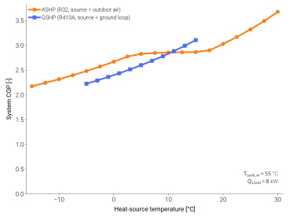

==================
Why physics-based?
==================

.. |cop| raw:: html

   COP

.. |epsilon-ntu| raw:: html

   ε-NTU

The name "Thermodynamic Models for Heat Pumps" describes *what*
TMHP is — a library of thermodynamic cycle models. *How* those
models are written is the part this page is about: every cycle is
solved from first principles, not fitted against catalogue data.

Most building-energy simulators take the opposite route. They model
a heat pump as an empirical curve fit — typically a polynomial in
(outdoor temperature, leaving-water temperature) calibrated against
the manufacturer's test points. That approach is cheap and accurate
*inside the calibration envelope*, but it carries three structural
limitations that this library was built to remove.

The three structural limits of curve fits
==========================================

.. list-table::
    :header-rows: 1
    :widths: 30 35 35

    * -
      - Curve-fit models
      - TMHP
    * - **Operating range**
      - Tied to the manufacturer's test points; extrapolation is
        unreliable.
      - Predictive across the full refrigerant envelope — limited by
        the EOS, not by training data.
    * - **Refrigerant**
      - Baked into the fitted coefficients. Changing R410A → R290
        requires a new dataset.
      - The refrigerant is a constructor argument
        (``ref="R290"``). Anything CoolProp supports works.
    * - **State visibility**
      - Cycle state is hidden behind the fit. You see |cop|; you
        don't see why.
      - Every cycle node (compressor in/out, expander in/out,
        evaporator / condenser saturation) is in the result frame
        at every step.

Same envelope, two different sources
====================================

The figure below sweeps the heat-source inlet temperature for an
ASHP (source = outdoor air) and a GSHP (source = ground-loop fluid)
at the same condenser duty and tank set-point. Both curves come
straight out of ``analyze_steady`` with no fitted coefficients — the
COP shape, including the steep ASHP drop below freezing, falls out of
the EOS through the compressor and heat-exchanger models.

        heat-source inlet temperature, at fixed tank set-point and
        condenser duty.
    :align: center
    :width: 100%

    System COP versus heat-source inlet temperature. The GSHP curve
    spans the narrow stable range of a ground loop; the ASHP curve
    extends across the wide but COP-eroding range of outdoor air.
    Generated by ``scripts/visualization/cop_vs_source_temp.py``.

What gets solved at every time step
====================================

Each released cycle-resolved family couples a closed refrigerant cycle
to its surrounding system. Boiler families target tank charge; ASHP and
GSHP target indoor-unit load, with positive ``Q_r_iu`` selecting cooling
and negative ``Q_r_iu`` selecting heating. The cycle solver then finds a
feasible low-power operating point rather than evaluating fitted
coefficients.

.. list-table::
    :header-rows: 1
    :widths: 35 65

    * - Sub-model
      - Method
    * - Refrigerant state points
      - `CoolProp <http://www.coolprop.org>`_ (REFPROP-grade EOS).
    * - Compressor work
      - Isentropic + volumetric + mechanical efficiency.
    * - Condenser / evaporator
      - |epsilon-ntu| heat exchanger model.
    * - Outdoor unit fan
      - ASHRAE 90.1-style VSD power curve, air-side ε-NTU.
    * - Borehole (GSHP)
      - g-function via
        `pygfunction <https://github.com/MassimoCimmino/pygfunction>`_.
    * - PV / solar thermal
      - `pvlib <https://pvlib-python.readthedocs.io>`_-driven
        irradiance and power.
    * - Cycle closure
      - Internal minimisation → optimal evaporating temperature.

The same core cycle is reused across the released cycle-resolved
families — what changes is the source boundary (air / ground / water),
the demand boundary (DHW tank or building load), and optional PV / STC /
ESS subsystems.

The compute trade-off
=====================

Solving an EOS state at every cycle node is more expensive than
evaluating a polynomial. In practice it lands around a few hundred
steps per second on a single core for the ASHPB reference case — fast
enough that a year-long minute-resolution run takes hours, not minutes.

If that is still too slow for your use case, a fitted surrogate is
the right escape hatch. TMHP tracks commercial catalogue data
well enough (see :doc:`../validation/index`) that you can train the
surrogate against this library itself, without collecting fresh
bench data.
