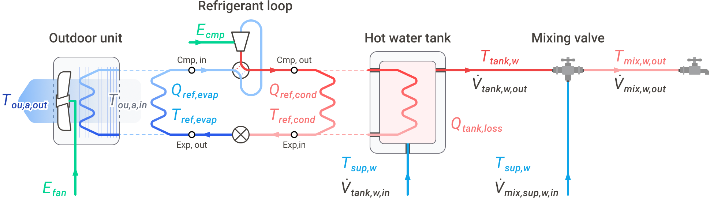
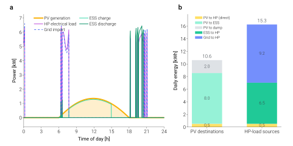

====================================
Air-source heat pump boiler (ASHPB)
====================================

.. |ashpb| raw:: html

   ASHPB

The ``ASHPB`` family pairs the shared refrigerant cycle with an
outdoor-coil source side and a DHW tank sink side. This is the
validated reference example used by the Getting Started flow.

Overview
========

|ashpb| solves the closed refrigerant cycle every step against an
outdoor coil (ε-NTU air-side) and a tank-coupled condenser. The
class is :class:`tmhp.AirSourceHeatPumpBoiler`. Three composed
variants extend it with subsystems:

- :class:`tmhp.ASHPB_STC_preheat` — STC heats the mains feed before it
  reaches the tank.
- :class:`tmhp.ASHPB_STC_tank` — STC charges a separate top node of a
  stratified tank.
- :class:`tmhp.ASHPB_PV_ESS` — PV generation + battery storage routes
  electricity to the compressor and auxiliaries before drawing grid.

        refrigerant loop, hot-water tank, and mixing valve.
    :align: center
    :width: 100%

    Reference ASHPB instantiation. This physical wiring view is useful
    for the validated air-source DHW case, while the shared compressor /
    expander / heat-exchanger cycle core is reused by the other TMHP
    source and demand-side families.

Base usage
==========

.. code-block:: python

   from tmhp import AirSourceHeatPumpBoiler

   ashpb = AirSourceHeatPumpBoiler(ref="R32")

   # Steady-state snapshot
   result = ashpb.analyze_steady(
       T_tank_w=55.0,    # tank water [°C]
       T0=7.0,           # outdoor air [°C]
       Q_ref_tank=8_000, # target condenser duty [W]
   )

   # Time-stepping dynamic run — see Getting Started for full schedule
   # construction.
   # df = ashpb.analyze_dynamic(...)

Default compressor efficiencies
===============================

A bare ``AirSourceHeatPumpBoiler`` uses the paper-validated compressor
relations below, where ``r_p`` is pressure ratio and ``rps`` is compressor
speed in revolutions per second:

- volumetric: ``1.0 - 0.020 * (r_p - 1.0)``
- isentropic: ``0.90 - 0.02 * r_p``
- combined electromechanical: ``0.80 - 3.0e-5 * (rps - 55.0) ** 2``

An explicitly supplied float or callable for the corresponding constructor
argument overrides these defaults.

Source-side mechanics
=====================

ASHPB models its outdoor coil as a variable-speed fan coupled to an
ε-NTU heat exchanger. Fan electrical power follows an ASHRAE
90.1-style cubic-with-speed curve; coil ε is recomputed each step
from the resolved refrigerant mass flow.

Sink-side mechanics
===================

The sink is a single-node DHW tank (with optional stratification on
the ``_STC_tank`` variant). The tank energy balance is solved
implicitly per step with ``fsolve``, jointly with the refrigerant
cycle.

Composed variants
=================

.. tab-set::
   :class: composition-tabs

   .. tab-item:: Base

      The standalone ASHPB: outdoor coil ε-NTU evaporator, R32 cycle,
      DHW tank charge.

      .. code-block:: python

         from tmhp import AirSourceHeatPumpBoiler

         ashpb = AirSourceHeatPumpBoiler(ref="R32")
         result = ashpb.analyze_steady(
             T_tank_w=55.0,
             T0=7.0,
             Q_ref_tank=8_000,
         )

   .. tab-item:: + STC preheat

      Adds a flat-plate STC that preheats mains water entering the
      tank. Reduces the tank-charge duty the heat pump has to deliver.

      .. code-block:: python

         from tmhp import ASHPB_STC_preheat
         from tmhp.subsystems import SolarThermalCollector

         stc = SolarThermalCollector(A_stc=4.0, stc_tilt=35.0, stc_azimuth=180.0)
         model = ASHPB_STC_preheat(stc=stc, ref="R32")

   .. tab-item:: + STC stratified

      STC charges a separate top node of a stratified tank; the heat
      pump charges the bottom. Top-of-tank water is drawn first.

      .. code-block:: python

         from tmhp import ASHPB_STC_tank
         from tmhp.subsystems import SolarThermalCollector

         stc = SolarThermalCollector(A_stc=4.0, stc_tilt=35.0, stc_azimuth=180.0)
         model = ASHPB_STC_tank(stc=stc, ref="R32")

   .. tab-item:: + PV / ESS

      Photovoltaic generation + ESS preferentially feeds the
      compressor and auxiliaries.

      .. code-block:: python

         from tmhp import ASHPB_PV_ESS
         from tmhp.subsystems import EnergyStorageSystem, PhotovoltaicSystem

         model = ASHPB_PV_ESS(
             pv=PhotovoltaicSystem(),
             ess=EnergyStorageSystem(),
             ref="R32",
         )

STC preheat
-----------

A :class:`~tmhp.subsystems.SolarThermalCollector` heats the cold mains
water before it reaches the DHW tank, so the heat pump sees pre-heated
water during the preheat window.

.. code-block:: python

   import numpy as np

   from tmhp import ASHPB_STC_preheat
   from tmhp.subsystems import SolarThermalCollector

   stc = SolarThermalCollector(
       A_stc=4.0,             # 4 m² collector area
       stc_tilt=35.0,
       stc_azimuth=180.0,
   )

   model = ASHPB_STC_preheat(stc=stc, ref="R32")

Drive it the same way as base ASHPB, adding irradiance schedules
(``I_DN_schedule``, ``I_dH_schedule``) — both in W/m² per step:

.. code-block:: python

   dt_s          = 60
   n_steps       = 24 * 3600 // dt_s
   hour_of_day   = np.arange(n_steps) / 60.0

   # Crude clear-sky irradiance: bell from 06:00 to 18:00.
   day_window    = (hour_of_day >= 6.0) & (hour_of_day <= 18.0)
   sun_shape     = np.sin(np.pi * (hour_of_day - 6.0) / 12.0)
   I_DN          = np.where(day_window, 800.0 * sun_shape, 0.0)
   I_dH          = np.where(day_window, 100.0 * sun_shape, 0.0)

   T0  = np.full(n_steps, 5.0)
   dhw = np.zeros(n_steps)

   df = model.analyze_dynamic(
       simulation_period_sec = n_steps * dt_s,
       dt_s                  = dt_s,
       T_tank_w_init_C       = 50.0,
       dhw_usage_schedule    = dhw,
       T0_schedule           = T0,
       I_DN_schedule         = I_DN,
       I_dH_schedule         = I_dH,
   )

To quantify the contribution, run the same schedules through a base
``AirSourceHeatPumpBoiler`` and difference the daily compressor
energy:

.. code-block:: python

   from tmhp import AirSourceHeatPumpBoiler

   base = AirSourceHeatPumpBoiler(ref="R32").analyze_dynamic(
       simulation_period_sec = n_steps * dt_s,
       dt_s                  = dt_s,
       T_tank_w_init_C       = 50.0,
       dhw_usage_schedule    = dhw,
       T0_schedule           = T0,
   )

   def daily_kwh(s, dt_s=dt_s):
       return float(s.sum()) * dt_s / 3.6e6

   saving = daily_kwh(base["E_cmp [W]"]) - daily_kwh(df["E_cmp [W]"])
   print(f"STC preheat saving: {saving:.2f} kWh/day")

.. autoclass:: tmhp.ASHPB_STC_preheat
    :no-index:
    :members:
    :show-inheritance:

STC with stratified tank
------------------------

.. autoclass:: tmhp.ASHPB_STC_tank
    :members:
    :show-inheritance:
    :no-index:

PV + ESS
--------

:class:`~tmhp.subsystems.PhotovoltaicSystem` generation feeds the
compressor and auxiliaries; an :class:`~tmhp.subsystems.EnergyStorageSystem`
buffers midday surplus for evening load; grid import covers
whatever the two cannot supply.

.. code-block:: python

   from tmhp import ASHPB_PV_ESS
   from tmhp.subsystems import EnergyStorageSystem, PhotovoltaicSystem

   model = ASHPB_PV_ESS(
       pv  = PhotovoltaicSystem(),
       ess = EnergyStorageSystem(),
       ref = "R32",
   )

   # Pass I_DN_schedule + I_dH_schedule to analyze_dynamic exactly
   # as you would for ASHPB_STC_preheat.

        Panel (a) is the timeseries of PV generation, HP load, and
        grid import. Panel (b) is the stacked-bar daily ledger of
        where PV ended up and where HP load came from.
    :align: center
    :width: 100%

    24-hour ``ASHPB_PV_ESS`` run with a clear-sky irradiance profile
    and default ``PhotovoltaicSystem`` / ``EnergyStorageSystem`` sizes.
    Panel (b) makes the sizing tradeoff readable: shrinking the ESS
    column on the left would push more of the right-hand bar from
    "PV" to "Grid". Generated by
    ``scripts/visualization/pv_ess_energy_balance.py``.

.. autoclass:: tmhp.ASHPB_PV_ESS
    :no-index:
    :members:
    :show-inheritance:

API reference
=============

.. automodule:: tmhp.air_source_heat_pump_boiler
    :members:
    :undoc-members:
    :show-inheritance:

.. automodule:: tmhp.ashpb_stc_preheat
    :members:
    :undoc-members:
    :show-inheritance:

.. automodule:: tmhp.ashpb_stc_tank
    :members:
    :undoc-members:
    :show-inheritance:

.. automodule:: tmhp.ashpb_pv_ess
    :members:
    :undoc-members:
    :show-inheritance:

Validation
==========

ASHPB has been benchmarked against the Samsung EHS Mono HT Quiet R32
14 kW catalogue across 15 operating points. See
:doc:`../validation/index` for the parity plot and per-point
comparison.
