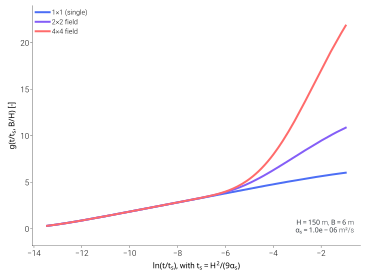

======================================
Ground-source heat pump boiler (GSHPB)
======================================

.. |gshpb| raw:: html

   GSHPB

The ``GSHPB`` family pairs the shared refrigerant cycle with a
ground-loop source side (vertical borehole field) and a DHW tank
sink.

Overview
========

|gshpb| solves the closed refrigerant cycle against a borehole heat
exchanger characterised by a precomputed **g-function**. The class is
:class:`tmhp.GroundSourceHeatPumpBoiler`. Composed variants
extend it the same way ASHPB's do:

- :class:`tmhp.GSHPB_STC_preheat`
- :class:`tmhp.GSHPB_STC_tank`
- :class:`tmhp.GSHPB_STC_ground`
- :class:`tmhp.GSHPB_STC_routed`
- :class:`tmhp.GSHPB_PV_ESS`

Base usage
==========

.. code-block:: python

   from tmhp import GroundSourceHeatPumpBoiler

   gshpb = GroundSourceHeatPumpBoiler(
       ref="R410A",
       N_1=1, N_2=1,      # single borehole
       H_b=150.0,         # depth [m]
   )

   result = gshpb.analyze_steady(
       T_tank_w=55.0,
       T_source=10.0,     # ground-loop fluid inlet [°C]
       Q_ref_tank=8_000,
   )

Source-side mechanics
=====================

For ground-source models, the source-side dynamics are encoded in a
**g-function** — the dimensionless thermal response of a borehole
field to a unit heat-extraction step. TMHP precomputes the
g-function once via
`pygfunction <https://github.com/MassimoCimmino/pygfunction>`_ and
interpolates it during the simulation, so the per-step cost stays
constant whether the field is one borehole or a hundred.

        field geometries: 1×1, 2×2, and 4×4.
    :align: center
    :width: 100%

    Dimensionless g-function for three rectangular borehole-field
    geometries. The 1 × 1 field is the single-borehole baseline;
    2 × 2 and 4 × 4 diverge as borehole-to-borehole thermal
    interference accumulates over the multi-year horizon. Generated
    by ``scripts/visualization/g_function_curve.py``.

Sink-side mechanics
===================

Single-node DHW tank, implicit per-step solve — the same demand-side
sink used by the air-source and water-source boiler families.

Composed variants
=================

Usage patterns for the tank-side variants follow the same demand-side
composition pattern as the air-source boiler family — see :doc:`ashpb`
for full STC preheat and PV + ESS examples. The ground-side STC
variants route collected solar heat into the borehole field instead
of, or in exclusive alternation with, the tank.

.. tab-set::
   :class: composition-tabs

   .. tab-item:: Base

      The standalone GSHPB: borehole-field g-function source, R32 cycle,
      DHW tank charge.

      .. code-block:: python

         from tmhp import GroundSourceHeatPumpBoiler

         gshpb = GroundSourceHeatPumpBoiler(
             ref="R410A",
             N_1=1, N_2=1,
             H_b=150.0,
         )
         result = gshpb.analyze_steady(
             T_tank_w=55.0,
             T_source=10.0,
             Q_ref_tank=8_000,
         )

   .. tab-item:: + STC preheat

      Adds a flat-plate STC that preheats mains water entering the
      tank. Reduces the tank-charge duty the heat pump has to deliver.

      .. code-block:: python

         from tmhp import GSHPB_STC_preheat
         from tmhp.subsystems import SolarThermalCollector

         stc = SolarThermalCollector(A_stc=4.0, stc_tilt=35.0, stc_azimuth=180.0)
         model = GSHPB_STC_preheat(stc=stc, ref="R410A", N_1=1, N_2=1, H_b=150.0)

   .. tab-item:: + STC stratified

      STC charges a separate top node of a stratified tank; the heat
      pump charges the bottom. Top-of-tank water is drawn first.

      .. code-block:: python

         from tmhp import GSHPB_STC_tank
         from tmhp.subsystems import SolarThermalCollector

         stc = SolarThermalCollector(A_stc=4.0, stc_tilt=35.0, stc_azimuth=180.0)
         model = GSHPB_STC_tank(stc=stc, ref="R410A", N_1=1, N_2=1, H_b=150.0)

   .. tab-item:: + STC ground

      STC injects collected heat into the borehole loop for seasonal
      ground charging; the DHW tank balance remains heat-pump-only.

      .. code-block:: python

         from tmhp import GSHPB_STC_ground
         from tmhp.subsystems import SolarThermalCollector

         stc = SolarThermalCollector(A_stc=4.0, stc_tilt=35.0, stc_azimuth=180.0)
         model = GSHPB_STC_ground(stc=stc, ref="R410A", N_1=1, N_2=1, H_b=150.0)

   .. tab-item:: + STC routed

      A per-step router sends solar heat either to the tank or to the
      borehole field. The default policy serves a cold tank first, then
      charges the ground.

      .. code-block:: python

         from tmhp import GSHPB_STC_routed
         from tmhp.subsystems import SolarThermalCollector

         stc = SolarThermalCollector(A_stc=4.0, stc_tilt=35.0, stc_azimuth=180.0)
         model = GSHPB_STC_routed(stc=stc, ref="R410A", N_1=1, N_2=1, H_b=150.0)

   .. tab-item:: + PV / ESS

      Photovoltaic generation + ESS preferentially feeds the
      compressor and auxiliaries.

      .. code-block:: python

         from tmhp import GSHPB_PV_ESS
         from tmhp.subsystems import EnergyStorageSystem, PhotovoltaicSystem

         model = GSHPB_PV_ESS(
             pv=PhotovoltaicSystem(),
             ess=EnergyStorageSystem(),
             ref="R410A",
             N_1=1, N_2=1, H_b=150.0,
         )

STC preheat
-----------

.. autoclass:: tmhp.GSHPB_STC_preheat
    :members:
    :show-inheritance:
    :no-index:

STC with stratified tank
------------------------

.. autoclass:: tmhp.GSHPB_STC_tank
    :members:
    :show-inheritance:
    :no-index:

STC to ground loop
------------------

.. autoclass:: tmhp.GSHPB_STC_ground
    :members:
    :show-inheritance:
    :no-index:

STC routed between tank and ground
----------------------------------

.. autoclass:: tmhp.GSHPB_STC_routed
    :members:
    :show-inheritance:
    :no-index:

PV + ESS
--------

.. autoclass:: tmhp.GSHPB_PV_ESS
    :members:
    :show-inheritance:
    :no-index:

API reference
=============

.. automodule:: tmhp.ground_source_heat_pump_boiler
    :members:
    :undoc-members:
    :show-inheritance:

.. automodule:: tmhp.gshpb_stc_preheat
    :members:
    :undoc-members:
    :show-inheritance:

.. automodule:: tmhp.gshpb_stc_tank
    :members:
    :undoc-members:
    :show-inheritance:

.. automodule:: tmhp.gshpb_stc_ground
    :members:
    :undoc-members:
    :show-inheritance:

.. automodule:: tmhp.gshpb_stc_routed
    :members:
    :undoc-members:
    :show-inheritance:

.. automodule:: tmhp.gshpb_pv_ess
    :members:
    :undoc-members:
    :show-inheritance:
