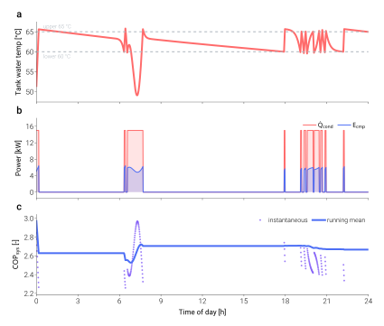

=============================
Realistic dynamic simulation
=============================

:doc:`../getting-started/first-dynamic-simulation` runs
``analyze_dynamic`` with flat schedules — a clean sanity check, but
real runs almost never look like that.

This tutorial assembles a more representative 24-hour scenario:

- a domestic-hot-water draw profile with morning and evening peaks;
- a sinusoidal outdoor-temperature schedule (overnight low,
  mid-afternoon high);
- and CSV output for downstream analysis.

What a real day looks like
==========================

        panels — tank temperature with its upper/lower bounds,
        condenser heat rate and compressor electrical power, and
        instantaneous + running-mean system COP.
    :align: center
    :width: 100%

    24-hour run of the ASHPB reference case with two DHW draws
    (07:00 and 20:00) and a sinusoidal outdoor temperature. Generated by
    ``scripts/visualization/dynamic_24h_timeseries.py``.

The schedule arrays
===================

.. code-block:: python

   import numpy as np

   simulation_period_sec = 24 * 3600
   dt_s                  = 60
   n_steps               = simulation_period_sec // dt_s
   minute_of_day         = np.arange(n_steps)
   hour_of_day           = minute_of_day / 60.0

   # Outdoor temperature: cosine, low at ~05:00, high at ~17:00 (12 h shift)
   T0_mean      = 5.0     # °C — daily mean
   T0_amplitude = 8.0     # ±°C
   T0_schedule  = T0_mean - T0_amplitude * np.cos(
       2 * np.pi * (hour_of_day - 5.0) / 24.0,
   )

   # DHW draw: two gaussian peaks (~07:00 and ~19:00).
   # 100 L over the day, spread across the two peaks.
   def gaussian_peak(center_h, sigma_h, total_volume_m3):
       weight = np.exp(-0.5 * ((hour_of_day - center_h) / sigma_h) ** 2)
       weight /= weight.sum()
       return weight * (total_volume_m3 / dt_s)   # m³/s per step

   dhw_morning = gaussian_peak(center_h=7.0,  sigma_h=0.6, total_volume_m3=0.040)
   dhw_evening = gaussian_peak(center_h=19.0, sigma_h=0.8, total_volume_m3=0.060)
   dhw_usage_schedule = dhw_morning + dhw_evening

Running and saving
==================

.. code-block:: python

   from tmhp import AirSourceHeatPumpBoiler

   ashpb = AirSourceHeatPumpBoiler(ref="R32")

   df = ashpb.analyze_dynamic(
       simulation_period_sec = simulation_period_sec,
       dt_s                  = dt_s,
       T_tank_w_init_C       = 55.0,
       dhw_usage_schedule    = dhw_usage_schedule,
       T0_schedule           = T0_schedule,
       result_save_csv_path  = "run_realistic.csv",
   )

``result_save_csv_path`` writes the per-step DataFrame to disk in
the same shape as the returned object — convenient for piping
into pandas / Excel without re-running the simulation.

Inspecting the run
==================

.. code-block:: python

   # Energy balance over the day
   E_cmp_kWh   = df["E_cmp [W]"].sum() * dt_s / 3.6e6
   Q_cond_kWh  = df["Q_ref_tank [W]"].sum() * dt_s / 3.6e6
   cop_sys_avg = df["cop_sys [-]"].mean()

   print(f"Total compressor energy  : {E_cmp_kWh:5.2f} kWh")
   print(f"Total condenser duty     : {Q_cond_kWh:5.2f} kWh")
   print(f"Daily-average COP_sys    : {cop_sys_avg:5.2f}")

   # When did the heat pump struggle?
   from collections import Counter
   print(Counter(df["failure_reason"]))

The ``Counter`` gives a quick view of how many steps hit each
diagnostic. For a sensible system at moderate ambient, almost
every step should be ``none`` — see
:doc:`../concepts/failure-reason-semantics` for what the other
values mean.

Where to go next
================

- Replace the synthetic outdoor schedule with real weather data
  resampled to your ``dt_s``.
- Drive a multi-day or annual run by concatenating schedules and
  passing the longer ``simulation_period_sec``.
- Plug in subsystems (STC, PV/ESS) — see
  :doc:`../models/ashpb`.
