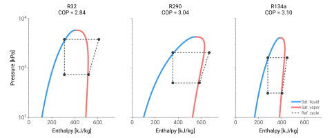

==================
Swap refrigerants
==================

The refrigerant is a constructor argument on every released
cycle-resolved model family in TMHP. Changing it requires no
recalibration and no manufacturer data — pick any name CoolProp
recognises and the library re-solves the cycle from first principles.
That's the single most concrete way to see what "refrigerant-agnostic"
means in this library.

This page is both a copy-runnable tutorial — sweep four refrigerants
at one operating point and inspect the COP — and an engineering
reference covering the ten working fluids that actually show up in
modern heat-pump design.

.. note::

   Property values quoted below are nominal engineering references
   from `ASHRAE Standard 34
   <https://www.ashrae.org/technical-resources/standards-and-guidelines>`_
   and CoolProp's REFPROP-grade equations of state. Always
   reconfirm against the EOS at your specific operating point
   before sizing — these tables are screening tools, not design
   data.

Sweep
=====

The sweep uses the ASHPB reference class so all refrigerants see the
same source and sink boundary. What changes is the refrigerant EOS and
the solved cycle state, not a fitted performance curve.

.. code-block:: python

   import pandas as pd

   from tmhp import AirSourceHeatPumpBoiler

   T_tank_w   = 55.0   # °C
   T0         = 5.0    # °C
   Q_ref_tank = 8_000  # W

   refrigerants = ["R32", "R290", "R410A", "R134a"]

   rows = []
   for ref in refrigerants:
       ashpb = AirSourceHeatPumpBoiler(ref=ref)
       r = ashpb.analyze_steady(
           T_tank_w=T_tank_w,
           T0=T0,
           Q_ref_tank=Q_ref_tank,
       )
       rows.append({
           "ref": ref,
           "cop_ref [-]": r["cop_ref [-]"],
           "cop_sys [-]": r["cop_sys [-]"],
           "E_cmp [kW]": r["E_cmp [W]"] / 1_000,
           "T_evap_sat [°C]": r["T_ref_evap_sat [°C]"],
           "T_cond_sat [°C]": r["T_ref_cond_sat_v [°C]"],
           "failure_reason": r["failure_reason"],
       })

   df = pd.DataFrame(rows)
   print(df.to_string(index=False))

The output is a four-row DataFrame — same ASHPB reference boundary,
same operating point, four refrigerants. Compressor power, saturation
temperatures, and COP all move together with the refrigerant's
EOS.

The cycles, side by side
========================

The same sweep, rendered on three P–h panels so the pressure shift is
visible at a glance. R290's saturation envelope sits roughly an order
of magnitude lower than R32's; R134a lands between the two.

        operating point, showing the saturation envelope and the
        converged refrigerant cycle for each ASHPB reference example.
    :align: center
    :width: 100%

    Converged refrigerant cycles for R32, R290, and R134a through
    the ASHPB reference boundary at
    :math:`T_{\mathrm{tank}}=55\,^{\circ}\mathrm{C}`,
    :math:`T_{0}=7\,^{\circ}\mathrm{C}`,
    :math:`\dot{Q}_{\mathrm{cond}}=8\,\mathrm{kW}`. Generated by
    ``scripts/visualization/refrigerant_compare_ph.py``.

.. raw:: html
   :file: ../_static/html/cycle_widget.html

Reading the result
==================

A few things to look for:

- ``failure_reason`` — should be ``none`` for all four at
  this operating point. If a refrigerant trips
  ``cycle_invalid`` or ``hx_not_converged``, see
  :doc:`../concepts/failure-reason-semantics`.
- **``cop_ref`` vs ``cop_sys``** — ``cop_ref`` is the cycle COP
  (condenser duty divided by compressor work). ``cop_sys`` also
  charges auxiliary power (fan, pumps) and is the figure that
  matches catalogue datasheets.
- **Saturation temperatures** — the evaporating temperature was
  found by the internal minimiser. Refrigerants with steeper
  saturation curves end up at different ``T_evap_sat`` even when
  the heat exchangers are identical.

Reference table
===============

.. list-table::
    :header-rows: 1
    :widths: 10 16 8 8 8 8 8 34
    :class: refrigerant-table

    * - Refrigerant
      - Type
      - ASHRAE
      - GWP\ :sub:`100`
      - T\ :sub:`crit` [°C]
      - NBP [°C]
      - Glide [K]
      - Primary applications

    * - **R32**
      - HFC, single
      - A2L
      - 675
      - 78
      - −52
      - 0
      - Residential AC and DHW heat pumps; the current R410A successor.

    * - **R290**
      - HC (propane)
      - A3
      - 3
      - 97
      - −42
      - 0
      - Monoblock outdoor heat pumps; commercial and EU-residential.

    * - **R600a**
      - HC (isobutane)
      - A3
      - 3
      - 135
      - −12
      - 0
      - Domestic refrigeration and small (<300 W) heat pumps.

    * - **R454B**
      - HFC/HFO blend
        (R32 / R1234yf, 68.9 / 31.1)
      - A2L
      - 466
      - 78
      - −51
      - ~1.5
      - Newer residential AC/HP; a near drop-in R410A replacement.

    * - **R134a**
      - HFC, single
      - A1
      - 1430
      - 101
      - −26
      - 0
      - Industrial heat pumps, chillers, transport refrigeration.

    * - **R513A**
      - HFC/HFO blend
        (R1234yf / R134a, 56 / 44)
      - A1
      - 631
      - 94
      - −29
      - <0.2
      - Industrial chillers; lower-GWP R134a replacement.

    * - **R410A**
      - HFC blend
        (R32 / R125, 50 / 50)
      - A1
      - 2088
      - 72
      - −51
      - <0.2
      - Legacy residential AC/HP; being phased down under F-gas regulation.

    * - **R1234ze(E)**
      - HFO, single
      - A2L
      - <1
      - 109
      - −19
      - 0
      - High-temperature heat pumps and centrifugal chillers.

    * - **R744**
      - CO\ :sub:`2`
      - A1
      - 1
      - 31
      - −78 (subl.)
      - n/a
      - Transcritical sanitary hot water (60–90 °C), supermarket refrigeration.

    * - **R717**
      - NH\ :sub:`3` (ammonia)
      - B2L
      - 0
      - 132
      - −33
      - 0
      - Large industrial heat pumps and process refrigeration.

The glide column shows the temperature difference between bubble
and dew points at constant pressure inside the two-phase region.
Single-component fluids and near-azeotropes (R410A, R513A) glide
by < 0.5 K; zeotropic blends (R454B) glide by ~1.5 K, which
matters for evaporator design and for fractionation behaviour on
a leak-and-recharge cycle.

Refrigerant catalogue
=====================

.. tab-set::

    .. tab-item:: R32

        **Difluoromethane** · single-component HFC

        :bdg-warning:`A2L low-flam` :bdg-success:`GWP 675`
        :bdg-info:`T_crit 78 °C`

        Default in this library and the refrigerant Samsung used
        for the validation unit. The de-facto successor to R410A
        in residential heat pumps.

        *Strengths*: high volumetric capacity (smaller
        displacement compressor for the same duty), single-
        component (no glide, no fractionation on a leak), and
        about one-third the GWP of R410A.

        *Watch outs*: A2L flammability triggers charge-limit
        rules in residential applications. Discharge temperatures
        run hotter than R410A — at high condensing temperatures
        an oil cooler or liquid injection may be needed.

        *Typical use*: residential AC and DHW heat pumps up to
        ~70 °C LWT; the current standard for new installations
        in most markets.

    .. tab-item:: R290

        **Propane** · natural hydrocarbon refrigerant

        :bdg-danger:`A3 flammable` :bdg-success:`GWP 3`
        :bdg-info:`T_crit 97 °C`

        Highest COP and lowest GWP of the mainstream picks. The
        long-term EU choice for residential and small-commercial
        heat pumps.

        *Strengths*: excellent thermodynamic match for the
        heat-pump envelope, near-zero GWP, low cost, miscible
        with mineral and POE oils, drop-in compatible with most
        copper / brass / steel plumbing.

        *Watch outs*: A3 high flammability brings charge limits
        (~150 g for residential indoor units under IEC 60335-2-40
        Amendment 1; higher for outdoor monoblock), which caps
        DX system size — most R290 heat pumps are sealed monoblock
        outdoor units with a hydronic loop into the building.

        *Typical use*: monoblock air-to-water heat pumps, small
        commercial DHW heat pumps, EU residential.

    .. tab-item:: R600a

        **Isobutane** · natural hydrocarbon refrigerant

        :bdg-danger:`A3 flammable` :bdg-success:`GWP 3`
        :bdg-info:`T_crit 135 °C`

        The dominant refrigerant in domestic refrigeration; rare
        but viable for very small heat pumps.

        *Strengths*: highest critical temperature of any HC,
        which gives headroom for high condenser temperatures.
        Negligible GWP. Very low operating pressures.

        *Watch outs*: low volumetric capacity (about a third of
        R290), so the same duty needs a substantially larger
        displacement compressor — economically unattractive above
        a few hundred watts. A3 flammability charge limits apply.

        *Typical use*: domestic refrigerators and freezers; some
        very-small (<300 W) heat-pump products.

    .. tab-item:: R454B

        **R32 / R1234yf zeotropic blend** (68.9 / 31.1) · HFC/HFO

        :bdg-warning:`A2L low-flam` :bdg-warning:`GWP 466`
        :bdg-info:`T_crit 78 °C`

        Designed as a low-GWP, drop-in-ish replacement for R410A
        in residential AC and heat pumps, with materially similar
        operating pressures.

        *Strengths*: about 78 % lower GWP than R410A while
        keeping similar capacity and pressure levels; compatible
        with R410A-class compressors and brazed-plate heat
        exchangers; lower discharge temperature than pure R32.

        *Watch outs*: A2L flammability constraints. ~1.5 K glide
        means the evaporator must be designed for a temperature
        spread, and fractionation on a partial leak shifts the
        composition — top off only with new refrigerant from
        liquid phase.

        *Typical use*: new residential and light-commercial AC
        and heat pumps in markets where R410A is being retired
        (US, EU).

    .. tab-item:: R134a

        **1,1,1,2-Tetrafluoroethane** · single-component HFC

        :bdg-success:`A1 non-flam` :bdg-danger:`GWP 1430`
        :bdg-info:`T_crit 101 °C`

        The classical industrial-chiller and medium-temperature
        refrigerant. High critical temperature makes it
        well-suited to high-LWT applications.

        *Strengths*: A1 safety, high T\ :sub:`crit` good for hot
        DHW or process heating up to ~80 °C, mature compressor
        and oil ecosystem, very well characterised EOS.

        *Watch outs*: GWP 1430 puts it on F-gas phase-down
        schedules. Lower volumetric capacity than R32 / R410A
        means physically larger compressors for the same duty.

        *Typical use*: industrial heat pumps and chillers, large
        centrifugal chillers, transport refrigeration. Newer
        designs increasingly use R513A or R1234ze(E) instead.

    .. tab-item:: R513A

        **R1234yf / R134a azeotropic blend** (56 / 44) · HFC/HFO

        :bdg-success:`A1 non-flam` :bdg-warning:`GWP 631`
        :bdg-info:`T_crit 94 °C`

        Direct R134a replacement that preserves the A1
        non-flammable rating while halving the GWP.

        *Strengths*: A1 safety retained (no flammability
        re-engineering); near-azeotropic (glide < 0.2 K), so
        drop-in into existing R134a chillers is usually feasible
        with only minor performance differences.

        *Watch outs*: still F-gas-listed (GWP 631), so
        long-horizon designs may prefer R1234ze(E) or R515B.
        Slightly lower volumetric capacity than R134a.

        *Typical use*: retrofit and new industrial chillers and
        heat pumps where the A1 rating is required.

    .. tab-item:: R410A

        **R32 / R125 zeotropic blend** (50 / 50) · legacy HFC

        :bdg-success:`A1 non-flam` :bdg-danger:`GWP 2088`
        :bdg-info:`T_crit 72 °C`

        The blend a generation of residential and light-
        commercial heat pumps were designed for. Strong precedent
        and tooling, but being phased out.

        *Strengths*: A1 non-flammable, high capacity, mature
        compressor and component ecosystem.

        *Watch outs*: GWP 2088 puts it on aggressive F-gas
        phase-down quotas — new equipment is increasingly
        prohibited (EU F-gas 2024 revision bans most R410A
        single-split AC ≤ 12 kW from 2027, all by 2032).
        Comparatively low T\ :sub:`crit` (~72 °C) limits high-LWT
        applications.

        *Typical use*: existing residential AC/HP installed base;
        legacy service. Not recommended for new system design.

    .. tab-item:: R1234ze(E)

        **trans-1,3,3,3-Tetrafluoropropene** · single-component HFO

        :bdg-warning:`A2L low-flam` :bdg-success:`GWP <1`
        :bdg-info:`T_crit 109 °C`

        Modern HFO with very low GWP and a high critical
        temperature. Increasingly common in high-temperature heat
        pumps and centrifugal chillers.

        *Strengths*: GWP under 1, high T\ :sub:`crit` supports
        condenser temperatures up to ~95 °C, A2L only at elevated
        temperature (above ~30 °C), single component.

        *Watch outs*: relatively low volumetric capacity — needs
        a physically larger compressor than R134a for the same
        duty. Higher cost than legacy HFCs. Material compatibility
        with elastomers should be verified.

        *Typical use*: large centrifugal water chillers, district
        heating / industrial water-to-water heat pumps producing
        80–95 °C LWT.

    .. tab-item:: R744

        **Carbon dioxide** · natural inorganic refrigerant

        :bdg-success:`A1 non-flam` :bdg-success:`GWP 1`
        :bdg-info:`T_crit 31 °C — transcritical`

        Operates as a transcritical cycle in heating applications:
        the high side is a supercritical gas cooler, not a
        condenser. Excellent match for very-high-temperature DHW
        (65–90 °C) thanks to the temperature glide of supercritical
        CO\ :sub:`2` along the gas cooler.

        *Strengths*: zero ODP, GWP 1, regulatory-future-proof,
        outstanding performance for hot-DHW heat pumps with cold
        return water (e.g. Japanese EcoCute), supports
        condensing-side temperatures other refrigerants can't
        reach without compromising COP.

        *Watch outs*: very high operating pressures (~100 bar on
        the gas-cooler side) — requires purpose-built compressors,
        heat exchangers, and instrumentation. Sub-cooler /
        expander details dominate COP; can't be analysed with a
        subcritical-condenser model — see
        :doc:`../concepts/refrigerant-and-coolprop` for how
        TMHP currently treats this case.

        *Typical use*: sanitary-water heat pumps (Japan, Europe),
        commercial / supermarket refrigeration, transport
        refrigeration.

    .. tab-item:: R717

        **Ammonia (NH\ :sub:`3`)** · natural inorganic refrigerant

        :bdg-danger:`B2L toxic, low-flam` :bdg-success:`GWP 0`
        :bdg-info:`T_crit 132 °C`

        The classical industrial refrigerant. Exceptional
        thermodynamic performance and zero environmental impact
        from emissions, but operates under strict safety codes.

        *Strengths*: highest cycle efficiency of any common
        refrigerant for typical industrial duties; zero GWP and
        zero ODP; very high T\ :sub:`crit` enables high-LWT
        operation; pungent self-alarming odour aids leak
        detection.

        *Watch outs*: toxic (Class B), incompatible with copper
        and brass alloys (steel and aluminium plumbing only),
        requires trained operators and ammonia-specific safety
        systems (ventilation, gas detection, evacuation
        procedures). Capital costs and footprint reflect the
        safety engineering.

        *Typical use*: large industrial heat pumps, food-process
        refrigeration, cold storage, district heating with
        recovered industrial heat.

Picking by application
======================

Use the sweep above as a screening step against the constraints
that actually matter for your application. A rough decision
guide:

*Residential AC / heat pump (split or monoblock, ≤ 12 kW, LWT ≤ 65 °C)*
    R454B (new) or R32 (still allowed in most markets) for split
    systems; R290 for sealed monoblock outdoor units. R410A only
    for service of existing installs.

*Domestic DHW heat pump (LWT 55–65 °C)*
    R32 or R290 for subcritical designs; R744 for the
    very-high-LWT (≥ 65 °C with cold return) hot-water-heat-pump
    pattern.

*High-temperature industrial heat pump (LWT 80–95 °C)*
    R1234ze(E), R134a, or R717 (ammonia). R600a is occasionally
    used for niche small units. TMHP solves these
    subcritically as long as T\ :sub:`crit` clears the condenser
    by ~10 K; check ``failure_reason`` for ``cycle_invalid``.

*Very-high-LWT (≥ 90 °C) industrial heat pump*
    R717 (ammonia) or R718 (water) — the latter requires a
    radically different compressor class and is not modelled here.
    Pure R134a / R1234ze(E) can reach 90 °C but with diminishing
    COP.

*Transcritical sanitary hot water (≥ 65 °C, cold return)*
    R744 — the only mainstream refrigerant whose cycle is
    optimised for this duty. Not subcritical, so the
    TMHP result is a sanity check rather than a design;
    see :doc:`../concepts/refrigerant-and-coolprop`.

*Industrial refrigeration and process cooling*
    R717 (ammonia) is the workhorse. R744 (CO\ :sub:`2`) is the
    growing alternative, often in CO\ :sub:`2`/NH\ :sub:`3`
    cascade systems for supermarkets and cold storage.

The screening table above narrows the candidate list. Once one
or two refrigerants survive, re-run a full annual simulation
with realistic schedules — see
:doc:`realistic-dynamic-simulation`.

Screening criteria summary
==========================

To recap the levers when picking from the table:

- **Operating-point COP** — what the sweep above reports. The
  refrigerant with the best COP at one operating point is rarely
  the best across an annual envelope; always confirm against
  ``analyze_dynamic`` with a realistic schedule.
- **Flammability class** — A1 (R410A, R134a, R513A, R744) →
  A2L (R32, R454B, R1234ze(E)) → A3 (R290, R600a). B-class
  (R717) is toxic and brings its own code regime.
- **GWP** — for new systems aim for GWP < 700 to align with the
  EU F-gas 2024 phase-down. R744 / R717 / R290 / R600a /
  R1234ze(E) are GWP-future-proof.
- **Critical temperature** — sets the practical condenser
  ceiling for a subcritical cycle. Check the
  ``T_ref_cond_sat_v`` column from the sweep against the
  refrigerant's T\ :sub:`crit` in the table.
- **Glide** — > 1 K (R454B) means the evaporator should be
  counter-flow and the refrigerant must be charged from the
  liquid phase.

Refer to :doc:`../concepts/refrigerant-and-coolprop` for how
CoolProp handles each refrigerant and the cycle-architecture
implications.
