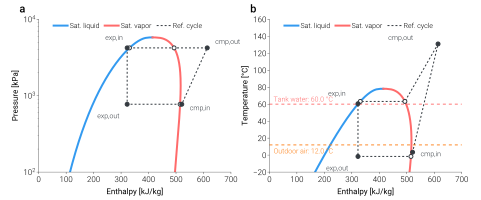
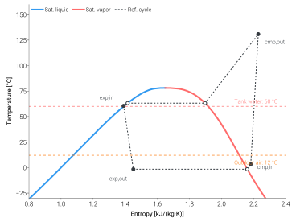

=============================
Visualize thermodynamic cycle
=============================

Because TMHP solves the cycle from first principles, every
``analyze_steady`` call returns the full thermodynamic state at each
cycle node (compressor in / out, expander in / out, evaporator /
condenser saturation). Plotting those points on a
pressure–enthalpy (P–h) chart — and, side by side, on a
temperature–enthalpy (T–h) chart — is the fastest way to
sanity-check a solved cycle.

This tutorial draws both panels with no extra dependencies — just
CoolProp and Matplotlib, both already pulled in by ``uv sync``.

The output
==========

        ASHPB reference boundary at T_tank = 60 °C, T_0 = 12 °C,
        Q_cond = 8 kW. Panel (a) shows the cycle on a P–h chart,
        panel (b) on a T–h chart with horizontal reference lines
        marking the tank-water and outdoor-air temperatures.
    :align: center
    :width: 100%

    R32 refrigerant cycle through the ASHPB reference boundary at a
    realistic DHW operating point —
    :math:`T_{\mathrm{tank}}=60\,^{\circ}\mathrm{C}`,
    :math:`T_{0}=12\,^{\circ}\mathrm{C}`,
    :math:`\dot{Q}_{\mathrm{cond}}=8\,\mathrm{kW}`.
    Filled circles are the four cycle states (cmp,in / cmp,out /
    exp,in / exp,out); open circles are the saturation-envelope
    crossings. Panel (b) overlays the tank-water and outdoor-air
    temperatures as the heat-sink and heat-source references.

.. raw:: html
   :file: ../_static/html/cycle_widget.html

The T-s companion view
======================

        the saturation dome and the four cycle nodes.
    :align: center
    :width: 100%

    Same cycle, plotted on a T-s plane. Compression (1→2) is a
    near-vertical climb (the cycle is close to isentropic), while
    isenthalpic expansion (3→4) generates entropy and sits visibly to
    the right of point 3 on the saturation dome.

How to read it
==============

- **Saturation envelope** — blue is saturated liquid, red is
  saturated vapour. The dome interior is two-phase; outside is
  single-phase liquid (left) or vapour (right).
- **Cycle traversal** — follow the four labelled states in order:

  - ``exp,out → cmp,in`` — evaporation at the source side. Horizontal
    segment on the P–h panel at the evaporating pressure; the T–h
    panel shows it tracking just above the outdoor-air reference
    line.
  - ``cmp,in → cmp,out`` — compression. Pressure climbs sharply;
    enthalpy increases by the specific work of the compressor.
  - ``cmp,out → exp,in`` — de-superheat + condensation at the
    condenser pressure. Enthalpy drops as the refrigerant gives
    up its latent heat to the water side; the T–h panel shows it
    settling just above the tank-water reference line.
  - ``exp,in → exp,out`` — isenthalpic expansion. Vertical segment
    on the P–h panel (h preserved, pressure drops); the T–h panel
    shows the corresponding temperature drop down to the evaporating
    temperature.

The script
==========

The complete script lives at
`scripts/visualization/mollier_cycle_R32.py
<https://github.com/bet-lab/TMHP/blob/main/scripts/visualization/mollier_cycle_R32.py>`_.
The core is a saturation-envelope sweep via CoolProp for each panel
plus a dashed connector through the seven cycle points returned by
``analyze_steady``:

.. code-block:: python

   import CoolProp.CoolProp as CP
   import matplotlib.pyplot as plt
   import numpy as np

   from tmhp import AirSourceHeatPumpBoiler

   REF = "R32"
   ashpb = AirSourceHeatPumpBoiler(ref=REF)
   r = ashpb.analyze_steady(T_tank_w=60.0, T0=12.0, Q_ref_tank=8_000.0)

   # Saturation envelope for the P-h panel (kJ/kg, kPa).
   T_crit = CP.PropsSI("Tcrit", REF)
   T_grid = np.linspace(220.0, T_crit - 0.5, 200)
   h_liq = np.array([CP.PropsSI("H", "T", T, "Q", 0, REF) for T in T_grid]) / 1_000
   h_vap = np.array([CP.PropsSI("H", "T", T, "Q", 1, REF) for T in T_grid]) / 1_000
   p_sat = np.array([CP.PropsSI("P", "T", T, "Q", 0, REF) for T in T_grid]) / 1_000

   def hp(h_key, p_key):
       return r[h_key] / 1_000, r[p_key] / 1_000

   pts = {
       "1*": hp("h_ref_evap_sat [J/kg]",   "P_ref_evap_sat [Pa]"),
       "1":  hp("h_ref_cmp_in [J/kg]",     "P_ref_cmp_in [Pa]"),
       "2":  hp("h_ref_cmp_out [J/kg]",    "P_ref_cmp_out [Pa]"),
       "2*": hp("h_ref_cond_sat_v [J/kg]", "P_ref_cond_sat_v [Pa]"),
       "3*": hp("h_ref_cond_sat_l [J/kg]", "P_ref_cond_sat_l [Pa]"),
       "3":  hp("h_ref_exp_in [J/kg]",     "P_ref_exp_in [Pa]"),
       "4":  hp("h_ref_exp_out [J/kg]",    "P_ref_exp_out [Pa]"),
   }

   fig, ax = plt.subplots(figsize=(7.2, 5.0))
   ax.plot(h_liq, p_sat, label="Sat. liquid")
   ax.plot(h_vap, p_sat, label="Sat. vapor")

   path = ["1*", "1", "2", "2*", "3*", "3", "4", "1*"]
   xs = [pts[p][0] for p in path]
   ys = [pts[p][1] for p in path]
   ax.plot(xs, ys, marker="o", linestyle=":", label="Ref. cycle")

   ax.set_yscale("log")
   ax.set_xlabel("Enthalpy [kJ/kg]")
   ax.set_ylabel("Pressure [kPa]")
   ax.legend()

The full script in the repo extends this minimal core with the T–h
panel, the operating-condition reference lines, and the open / filled
marker convention used in the figure above.

To regenerate the figure shipped with the docs:

.. code-block:: bash

   uv sync --locked
   uv run python scripts/visualization/mollier_cycle_R32.py

The script pins ``mpl.rcParams["svg.hashsalt"]`` so the resulting SVG
is byte-identical across runs — the same convention used by
``scripts/validation/samsung_ehs_parity.py``.

Going further
=============

- **Other refrigerants** — change ``REF`` (and re-run
  ``analyze_steady`` with the same operating point) to compare
  cycle shapes across R290, R410A, R134a, etc.
- **Other diagrams** — the library also ships a ``mollier_diagram``
  module with T–h, P–h, and T–s plotters in
  :doc:`../api/support/visualization`. These are styled with
  `dartwork-mpl <https://github.com/dartworklabs/dartwork-mpl>`_,
  a thin matplotlib utility layer that is pulled in automatically
  by ``uv sync``.
- **Multi-point overlays** — pass several ``analyze_steady``
  results to the same figure to compare cycles at different
  outdoor temperatures or different LWT set-points.
