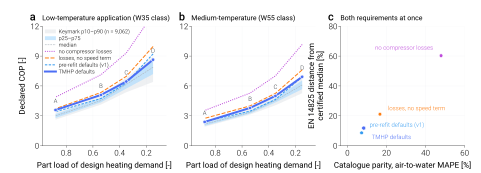

============================
Where the defaults come from
============================

TMHP decides a lot on your behalf. Hand it a capacity and a refrigerant and it
produces heat-exchanger conductances, a compressor displacement, a rated air
flow and three efficiency correlations. That convenience is the point of the
library — but it is only worth having if each of those numbers can be traced to
a published document rather than to somebody's judgement, and if you can rerun
the step that produced it.

This page is that trace. Every row links to the source and to the script that
reads it.

.. admonition:: The one rule behind all of it
    :class: important

    Published literature reports the conductance, displacement or efficiency of
    *particular machines*. Nobody publishes a rule expressed per unit of
    capacity — which is exactly what a model that sizes its own components
    needs. So the numbers below are not taken from a paper. They are derived
    from populations: manufacturer catalogues that rate an entire product range
    at one declared condition, which makes models of different capacity
    comparable by construction. The citations are for the *method*, the
    *rating standard* and the *correlation*; the numbers are measured across
    many machines.

    A consequence worth stating plainly: validating against a catalogue is
    never calibrating against it. No parameter below is fitted to any unit in
    :doc:`the validation set <index>`.

Summary
=======

.. list-table::
    :header-rows: 1
    :widths: 22 26 32 20

    * - Quantity
      - Default
      - Where it comes from
      - Reproduce
    * - Outdoor coil conductance (air-to-air)
      - ``UA_ou = hp_capacity / 5``
      - 1,414 component coils across two rating standards and six
        manufacturers, converted to the nameplate basis; independently checked
        against 12 heat pumps' published coil geometry
      - ``ua_transfer_law``
    * - Indoor / outdoor conductance ratio
      - ``UA_iu = 0.8 × UA_ou``
      - Derived, not chosen: both faces are air coils, so the ratio is the duty
        ratio ``1 / (1 + 1/EER)``
      - ``ua_transfer_law``
    * - Tank heat-exchanger conductance (air-to-water)
      - ``UA_tank_hx = hp_capacity / 5``
      - 5 K equivalent LMTD; inside the band Deutz et al. (2018) fit for a
        tank-mantle machine
      - —
    * - Evaporator / condenser conductance ratio (air-to-water)
      - ``UA_ou = 0.7 × UA_tank_hx``
      - Duty ratio ``1 − 1/COP``; the measured approach temperatures on the two
        sides are close enough for the transfer to hold
      - ``en328_inversion``
    * - Compressor displacement
      - ``V = Q̇ / (Δh · ρ · η_vol · n_rated)``
      - Pure fluid property from CoolProp at a declared rating point; rated
        speed inverted from nine machines with published displacement
      - ``compressor_speed``
    * - Isentropic efficiency
      - ``(1.0849 − 0.0735 · PR − 0.5729 / PR) / 0.936``
      - Pressure-ratio shape of the electrical-to-isentropic product fitted on
        standalone compressor data (76 machines, 131 speed records); divided by
        the measured electro-mechanical level so the product is reproduced
      - ``compressor_maps.fit``
    * - Volumetric efficiency
      - ``1 − 0.0216 (PR − 1) − 0.0177 · max(0, 1/n* − 1)``
      - Clearance re-expansion plus the extra leakage fraction at low relative
        speed ``n* = n / n_rated``; leave-one-compressor-out MAPE 5.7 %
      - ``compressor_maps.fit``
    * - Electro-mechanical efficiency
      - ``0.936 × n*(1 + 0.021)/(n* + 0.021)``
      - Saturating drive-loss shape fitted across the compressor set; level
        from the measured discharge-temperature split of Cuevas & Lebrun
      - ``compressor_maps.fit``
    * - Rated outdoor air flow
      - 720 m³/h per kW (air-to-air), 540 (air-to-water)
      - Manufacturer specifications for the respective product classes
      - —

Every ``Reproduce`` entry is a module under ``validation/extraction/`` or
``validation/compressor_maps/``::

    uv run python -m validation.extraction.<name>
    uv run python -m validation.compressor_maps.<name>

The compressor coefficients are frozen as version ``v2026-09-15b``
(:data:`tmhp.compressor_efficiency.COEFFICIENT_VERSION`); the archive under
``validation/coefficients/v2026-09-15b/`` holds the data list, the fits, the
cross-validation and the selection table.

Heat-exchanger conductance
==========================

The problem
-----------

``AirSourceHeatPump`` generates both coil conductances from a single declared
capacity. What has to be established is therefore a capacity-normalised rule
and a ratio — not any particular machine's conductance. Before this work the
code carried ``hp_capacity / 10`` and a ratio of ``0.8`` with no citation
anywhere, in the source or in the manuscript.

Why catalogue inversion is not a fit
------------------------------------

When the refrigerant side of a coil changes phase its capacity rate is
unbounded, the capacity-rate ratio vanishes, and the LMTD and
effectiveness-NTU descriptions of the coil become the same equation:

.. math::

    UA = -\ln\!\left(1 - \frac{\dot Q}{C_{\mathrm{air}}\,\Delta T_1}\right) C_{\mathrm{air}}

A catalogue that declares duty, air volume flow and a rating temperature
difference therefore pins the conductance exactly. There is no parameter to
choose, so the result is either right or the table was misread — and a misread
column almost always pushes the effectiveness outside ``(0, 1)``, which the
code refuses. ``validation.extraction.dt_convention`` checks the identity
numerically over NTU 0.2–5.0.

This also settles a question that looks like it needs a convention: it does
not. ``UA/Q`` is the same number whether you compute it on an LMTD or an
inlet-end basis. Only the *outlet-end approach temperature* differs, and that
converts exactly through the NTU. All conductances here are reported as an
equivalent LMTD, which is why they can be compared across sources at all.

What the catalogues say
-----------------------

.. list-table::
    :header-rows: 1
    :widths: 16 12 34 12 13 13

    * - Rating standard
      - Models
      - Manufacturers
      - Air flow [m³/h per kW]
      - ``UA/Q`` median
      - Equivalent LMTD
    * - EN 328 SC2 (evaporators)
      - 352
      - Alfa Laval · Güntner ×2 · GEA Searle
      - 584
      - 0.190
      - 5.28 K
    * - ENV 327 (condensers)
      - 1,062
      - LU-VE · Alfa Laval
      - 240
      - 0.146
      - 6.86 K

Two standards written by different committees for different applications,
adopting air flows per kilowatt that differ by a factor of 2.4, place their
product populations in the same band of conductance per unit duty. That
agreement *between* the standards is the evidence. A regression *through* them
would mean nothing: inside a single standard ``UA/Q`` and air flow are linked
by an identity rather than a trend, so the points lie on a curve and a line
fitted through two such curves is an artefact.

.. admonition:: A claim withdrawn
    :class: caution

    An earlier version of this work reported a pooled regression of ``UA/Q``
    against air flow — slope −0.020, R² 0.001 — as evidence that the two are
    unrelated. That was wrong for the reason just given, and it is withdrawn.
    What survives is that the two bands overlap, which is circumstantial. The
    proof is the geometric route below, which is bound by no rating identity at
    all and lands in the same place.

From the band to the default
----------------------------

The nameplate is the *indoor* coil's cooling duty; the outdoor coil rejects
that duty plus the compressor work. A rule written against the nameplate has to
carry ``1 + 1/EER`` explicitly — 1.29 to 1.35 across the reference units.
Skipping it misses by about 30 %. Applying it to the condenser band gives
``UA/Q_cool = 0.19``, that is ``hp_capacity / 5``.

Adding the second condenser manufacturer late in this work was a useful test of
how settled that is: it moved the condenser median by 5 % and the rounded
default not at all.

The independent check
---------------------

Trane prints, for every Precedent packaged heat pump, the outdoor coil's face
area, row count, fin density and tube size *together with* the outdoor fan flow
and the rated capacity. That is enough to compute the conductance directly from
a published air-side correlation — `Wang, Chi & Chang (2000)
<https://doi.org/10.1016/S0017-9310(99)00333-6>`_, already cited by the
manuscript — with Schmidt fin efficiency, without reference to any component
catalogue. The two routes share neither inputs nor method.

Over twelve units of two refrigerant generations the geometric route gives
``UA/Q_cool`` between 0.119 and 0.206, a median of ``Q/6.8``, and implied
condensing temperatures of 47–55 °C at the 35 °C rating point, which is the
product class's ordinary range. Its largest declared quantity is the
refrigerant-side film coefficient: at 2500 W/(m² K) the route gives ``Q/6.8``,
and with that resistance removed entirely it gives ``Q/4.3``. The band result
sits between the two.

That is why the band route sets the default: it needs no assumption about the
refrigerant side at all. The geometric route is the corroboration, and
``validation.extraction.trane_geometry`` prints the sensitivity of its answer
to every quantity it had to declare rather than read.

.. admonition:: How wide the band is, and what that costs you
    :class: warning

    ``Q/5`` is a *median*. On the nameplate basis the population it came from
    spans **``Q/3.3`` to ``Q/7.1``** at p10–p90, and that width is real
    hardware, not measurement noise.

    The validation set shows what it costs. Backing the conductance out of each
    machine's own rating point, the five Daikin splits imply ``Q/3.7`` to
    ``Q/6.0`` — all inside — while the two Fujitsu splits imply ``Q/7.6`` and
    ``Q/8.5``, just outside the low-conductance end. Their nameplate
    efficiencies differ accordingly: EER 5.41 down to 3.23 across the seven.

    So a single vendor-neutral default describes a typical machine near the
    efficient end of current practice, and **will over-predict a
    lower-efficiency product line**. If you know the machine, pass
    ``UA_ou_rated``. :doc:`index` decomposes the rest of that residual, which
    is not all conductance.

    .. note::

        Quote the band on the same basis as the rule. Component catalogues
        report conductance per unit of *coil* duty (``UA/Q`` 0.108–0.230); the
        rule is written against the *nameplate*, and the two differ by
        ``1 + 1/EER`` = 1.307. An earlier version of this page carried the
        median across but not the band.

.. admonition:: Where this does not apply at all
    :class: warning

    The rule is established for dry, round-tube-plate-fin outdoor coils of
    packaged equipment. Frosted operation, microchannel coils and the
    residential mini-split product class lie outside the evidence. The
    mini-split exclusion matters in practice: TMHP's rated air-flow default of
    720 m³/h per kW is a mini-split figure, while the geometric evidence comes
    from packaged units at roughly half that. The two defaults presently point
    at different product classes, and that is an open item rather than a
    resolved one.

Compressor displacement
=======================

The machine has to move enough refrigerant to carry the nameplate duty at the
nameplate condition:

.. math::

    V_{\mathrm{disp}}
        = \frac{\dot Q_{\mathrm{nom}}}
               {\Delta h \; \rho_{1} \; \eta_{\mathrm{vol}} \; n_{\mathrm{rated}}}

Both :math:`\Delta h` and :math:`\rho_1` come from CoolProp at a declared
rating point, so the dependence on the working fluid is pure fluid property
rather than a tabulated coefficient. That dependence is not small: per kilowatt
of nameplate the displacement runs from about 3.9 cm³/rev for R32 to 10.4 for
R1234yf. The constant this replaced took no account of the fluid at all.

The rating point is declared per equipment class — EN 14511 A7/W35 for
air-to-water, ISO 5151 T1 for air-to-air — and the rated speed is the one
quantity that carries real uncertainty, since the result is exactly inversely
proportional to it.

For air-to-water it is not a guess. Inverting the relation against the nine
Panasonic Aquarea units whose compressor displacement is published by the
manufacturer's compressor division gives a median rated speed of 42 rev/s, and

.. list-table::
    :header-rows: 1
    :widths: 20 26 26 28

    * - Nameplate
      - R32
      - R290
      - R410A
    * - 9 kW
      - 33.6 rev/s
      - 32.8
      - 36.2
    * - 12 kW
      - 44.9
      - 43.7
      - 48.3

— at a fixed capacity the three refrigerants agree within 5 %. The physics
carries the fluid dependence on its own. The scatter that remains is the
manufacturers' practice of sharing one compressor across adjacent capacity
steps: in all three of those product lines the 9 and 12 kW units use the same
machine, which no continuous rule can reproduce.

For air-to-air the evidence is thinner. Daikin's SL-series service manual
publishes rated compressor frequency in place of displacement — 52 rev/s
cooling for the 2.5 kW class, 72 for the 3.5 kW class — and no displacement is
published anywhere to check the result against. A search of five data books,
three service manuals and two specification sheets, about 90 MB, returned no
displacement for any Daikin, Fujitsu or Trane unit; every ``cm³`` in those
documents is an oil charge. This is the weakest link in the chain and is
treated as such.

.. tip::

    A displacement error is second order for steady-state COP: the speed solver
    absorbs it into speed, and the result moves only through the speed
    dependence of the efficiencies. Where it matters is the modulation envelope
    — displacement and ``rps_min`` jointly fix the lowest duty the machine can
    deliver. If you know your machine's displacement, pass ``V_cmp_ref``.

Compressor efficiency
=====================

A variable-speed compressor loses work in three distinguishable places, and
TMHP keeps them separate because they act on different outputs: the isentropic
efficiency sets the discharge enthalpy (and so the heating duty), the volumetric
efficiency sets the mass flow, the electro-mechanical efficiency sets the
electrical input. The correlations live in :mod:`tmhp.compressor_efficiency`
and are shared by every model.

Compressor data, not heat-pump data
-----------------------------------

The coefficients are fitted to *standalone compressor* performance and then
frozen. Heat-pump catalogue COP is never used to fit them — a catalogue COP
mixes compressor, conductance, fan and latent effects, and fitting the
compressor to it would let a conductance error hide inside an efficiency
coefficient. The catalogue set is what the assembled model is checked against
afterwards (:doc:`index`).

.. list-table::
    :header-rows: 1
    :widths: 30 14 14 42

    * - Source
      - Machines
      - Speed records
      - What it gives
    * - Copeland Online Product Information — AHRI 540 coefficient sets of the
        ZPV / XPV / YPV / ZHV / YHV variable-speed scrolls
      - 63
      - 96
      - Capacity, power and mass-flow polynomials at two or three rated speeds
        per machine (``n*`` 0.27–1.3), R-410A, R-32, R-407C; dew-point
        rating, 20 °F superheat, 15 °F subcooling, power at the drive input
    * - `Cuevas & Lebrun (2009) <https://doi.org/10.1016/j.applthermaleng.2008.03.016>`_
      - 1
      - 5
      - 48 calorimeter tests of an R-134a scroll, 35–75 Hz, with measured
        discharge temperature — the only rows that split the product under
        TMHP's own definition
    * - `Guth & Atakan (2023) <https://doi.org/10.1016/j.ijrefrig.2022.10.024>`_
      - 1
      - 4
      - Published efficiency functions of an R-290 scroll (ZHV046), evaluated
        on their fitting envelope, 1800–5400 rpm
    * - Highly rotary catalogue 2024
      - 8
      - 1
      - R-290 inverter rotaries at their ASHRAE/T rated point, 3600 rpm — a
        level anchor for the rotary type, no speed information
    * - `Shao et al. (2004) <https://doi.org/10.1016/j.ijrefrig.2004.02.008>`_
      - 3
      - 18
      - Manufacturer map polynomials of three inverter rotaries (Mitsubishi,
        SANYO, Hitachi; R-22 inferred) at 30–120 Hz, ``n*`` 0.4–2.0 — the
        only rows above 1.5× rated speed; two of the three fail the
        displacement check and enter the product fit only

Every point is reduced to the same three quantities with CoolProp at the
source's own rating convention: ``eta_vol = ṁ / (ρ_suc V n)``,
``eta_oi = ṁ Δh_is / P_el`` and, where a discharge temperature is printed,
``eta_isen = Δh_is / (h_dis − h_suc)``. Fixed-speed machines, grid points
outside a 15–60 K lift or a 1.5–8 pressure ratio, and machines whose printed
displacement fails a rated-point volumetric check are excluded and listed in
the archive.

What the data identify
----------------------

Power tables identify the *product* ``eta_isen · eta_em``, not its factors.
With no speed term in the isentropic efficiency and no lift term in the
electro-mechanical one the product is separable, ``g(PR) · s(n*)``, up to one
scale factor: how much of the electrical loss shows up as refrigerant enthalpy
rather than leaving through the shell and the drive. That factor is fixed by
the Cuevas & Lebrun rows with measured discharge temperature near rated speed,
``eta_em(n* = 1) = 0.936`` (p10–p90 0.926–0.942), and its ±0.03 sensitivity is
reported with the coefficient archive.

The speed penalty measured across the Copeland set does grow with pressure
ratio (the interaction term is statistically significant across 49 machines).
Carrying it would need a speed term in the isentropic efficiency; it buys
0.05 pp of cross-validated error once the rotary maps are in and is kept as a
documented extension, not adopted. The correlations only become more complex
when the data demand it clearly, and 0.05 pp against a between-machine spread
of 7 pp is not that.

A speed term must also be *identified* by the machines that carry it. The
three 2004 rotaries are the only maps above 1.5× rated speed, and their whole
level sits 27 % below the population; pooled, that level shift looks like a
high-speed roll-off (a fitted 28 % at twice rated speed, and 0.8 pp of
cross-validated gain). Inside each of those machines the trend is a tenth of
the fitted magnitude. Rule R4 therefore compares every added speed term with
the within-machine trend of the machines that see it and accepts the term only
if they show at least two thirds of it; the roll-off fails (0.12), the low-speed
drive loss passes (2.2 — the machines show it more strongly than the pooled fit
does). The form keeps a zero-valued roll-off coefficient so a second
high-speed source can switch it on.

Selection
---------

Five volumetric and fifteen product families were compared by
leave-one-compressor-out cross-validation: refit without each machine, predict
it, pool the error weighted so every compressor × speed record counts once.
A family is accepted over its simpler parent only if each extra coefficient
buys at least 0.1 pp of cross-validated MAPE, no stratum with three or more
machines gets worse by more than 2 pp or 25 %, the delivered duty
``n · eta_vol`` stays monotonic in speed on the whole grid, and any added
speed term is seen within the machines that identify it (above).

.. list-table::
    :header-rows: 1
    :widths: 22 44 17 17

    * - Efficiency
      - Adopted form
      - LOCO MAPE
      - Pre-refit (v1)
    * - Volumetric
      - ``1 − 0.0216 (PR − 1) − 0.0177 max(0, 1/n* − 1)``
      - 5.66 %
      - 5.88 %
    * - Product ``eta_isen · eta_em``
      - ``(1.0849 − 0.0735 PR − 0.5729/PR) · n*(1.021)/(n* + 0.021)``
      - 12.16 %
      - 12.21 %

The product's pressure-ratio shape peaks near ``PR = sqrt(C/B) ≈ 2.8`` — the
built-in volume ratio of an air-conditioning scroll — and falls on both sides:
under-compression below, over-compression and leakage above. Its speed factor
is the saturating drive-loss form Ossorio & Navarro-Peris fit to 185 inverter
measurements, here with the time constant fitted on the whole set; an
exponential alternative scored within 0.06 pp (inside the 0.1 pp resolution
the acceptance rule itself uses) and the form with the physical precedent was
kept. The pooled error of the product is dominated by the three R-22 rotaries
(32 % in their stratum against 9 % for the scrolls): their level, not their
shape, is what the population does not share. The volumetric speed term is one-sided (no bonus above
rated speed): the Copeland set loses about 5 points of volumetric efficiency
at a quarter of rated speed, a third of what the pre-refit leakage term had
extrapolated from one machine.

Speed is read relative to the machine's rated speed, ``n* = n / n_rated``: a
drive and motor are sized for the speed the compressor is rated at, and a
shape measured on one machine transfers as curvature about that point, not as
an absolute speed. The heat-pump models bind their own rated point (40 rev/s
air-to-water, 60 rev/s air-to-air, :mod:`tmhp.compressor_speed`).

What is deliberately absent
---------------------------

No low-load cliff, and no refrigerant-specific coefficient set. The residuals
were stratified by refrigerant, compressor type, source, speed and pressure
ratio; no stratum with three or more machines asked for its own coefficients.
The rotary type is represented by eight modern R-290 rated points and three
2004 R-22 maps; the modern rotaries sit at the population level (7–9 % in
their stratum), the 2004 machines 27 % below it, so the shape carries over and
the level of an old induction-motor rotary does not. A modern multi-speed
rotary map is still the first data gap (see the report archive).
See :doc:`part-load` for why inventing a low-load roll-over would contradict
the certified measurements.

Does the coefficient set survive both tests?
--------------------------------------------

The three correlations were fitted on compressor measurements, not on heat
pumps. Whether that was worth anything is a separate question with two halves:

* **Shape.** EN 14825 lowers the required duty and the flow temperature together
  across four test points, and Heat Pump Keymark publishes what real machines
  declare at each of them. A coefficient set can be checked against the
  certified *population* (:doc:`part-load`).
* **Level.** A set can sit on the certified median and still miss every
  individual machine. That is what the catalogue parity set answers (:doc:`index`).

Four compressor descriptions were run through both, identically:

        medium-temperature applications against the Keymark band for four
        compressor descriptions, and a plane placing each description against
        catalogue parity error and distance from the certified median.
    :align: center
    :width: 100%

    **(a, b)** The certified trajectory, low- and medium-temperature
    application. **(c)** Both requirements at once.

.. list-table::
    :header-rows: 1
    :widths: 26 40 17 17

    * - Description
      - What it is
      - Parity MAPE (air-to-water)
      - Bias

    * - ``ideal``
      - all three efficiencies pinned at 1.0 — what ASHP did before this work
      - 47.9 %
      - +47.9 %

    * - ``constant``
      - the adopted correlations frozen at their rated point, no speed dependence
      - 15.4 %
      - +12.2 %

    * - ``legacy-v1``
      - the pre-refit defaults: ``0.90 − 0.02 PR``, the one-machine leakage term,
        the Guth speed shape at 0.80 (``validation/coefficients/v1-legacy/``)
      - 7.3 %
      - -1.6 %

    * - **``defaults``**
      - **what TMHP ships — coefficients ``v2026-09-15b``**
      - **8.1 %**
      - **+1.1 %**

Parity figures are the ten adopted air-to-water units (153 points); the held
Fujitsu catalogues are excluded from every headline.

Three things to read off it.

**The coefficients carry most of the model.** An ideal compressor is
47.9 % out on the catalogues; removing only the speed dependence
costs 7.3 points of MAPE.

**The shape passes, at every configuration.** Across fifteen combinations of
capacity, refrigerant and sizing ratio the modelled COP rises at every step
A → D in all fifteen low-temperature runs (96.9 % of the 9,062 certified
low-temperature records do the same), and the A-to-D gradient lands inside the
certified p10–p90 in all thirty runs: median 2.48 modelled
against 2.63 certified for the low-temperature application, 2.93
against 2.86 for the medium-temperature one. The refit made the low-temperature
gradient flatter than before (2.70): the fitted product falls
below a pressure ratio of about 2.5 — under-compression in a scroll with a
fixed built-in volume ratio — and point D runs near ``PR = 1.6``.

**The level sits above the median, and the sign is predicted.** Read as
percentiles of the certified population, the low-temperature trajectory sits
at the 94 / 91 / 69 / 83th percentile at points A / B / C / D and the medium-temperature
one at 85 / 93 / 88 / 89. Certified COP is measured with defrost and, at the light
points, with on/off cycling; TMHP models neither, so a model above the median
is the expected direction. Points A and B sit near the 90th percentile — one
decile higher than the pre-refit set, the same signal as the +1.1 % air-to-water
parity bias: the compressor population the coefficients come from is the
efficient side of the heat-pump population. Neither result moves a coefficient;
both are recorded (:doc:`index`).

.. admonition:: What changed on the medium-temperature trajectory
    :class: note

    The previous edition of this page marked point C of the medium-temperature
    application as an artefact: every description dropped to 77 % of the
    certified median there because the operating-point search starved the
    outdoor coil below the compressor speed floor. That search now scores
    candidates by electrical input per unit of heat delivered
    (:mod:`tmhp._opt_utils`), and the point sits in line with its neighbours
    (88th percentile). See :doc:`part-load`.

Reproduce both halves with::

    uv run python -m validation.en14825_seasonal_trend.air_to_water
    uv run python3 scripts/validation/en14825_verdict_figure.py

Provenance
==========

The source documents are archived locally but **not** committed: publisher PDFs
and supplementary datasets are not redistributable. The tracked half is
``validation/registry/sources.yaml``, which records what each document is,
where to obtain it and the SHA-256 of the copy the scripts were run against. A
reader who obtains the same document from the manufacturer and gets the same
checksum is running on identical bytes, and everything under
``validation/data/`` follows from those bytes by the scripts in
``validation/extraction/``.

.. seealso::

    :doc:`index`
        Catalogue parity results, unit by unit.

    :doc:`part-load`
        The part-load trend, and the certified data it is judged against.

    :doc:`adding-a-catalogue`
        How to add a unit and have all of it update.
