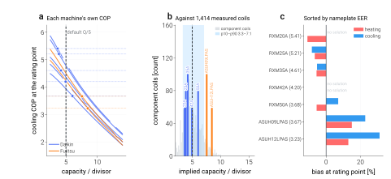

==========
Validation
==========

A physics-based model is only useful if its first-principles answers land close
to the real machines it is meant to describe. This page is that check.

The harder question is whether it keeps landing close when the machine changes.
A model tuned to one unit will match that unit; what tells you something is
whether the same defaults, unchanged, follow a different refrigerant, a
different size, and a different equipment architecture.

.. admonition:: How to read these numbers
    :class: important

    **Nothing here is fitted to anything here.** Every unit is run with the
    library defaults exactly as shipped. The only per-unit inputs are values the
    manufacturer publishes about the machine itself — nameplate capacity,
    refrigerant, and, where the manufacturer publishes them at all, compressor
    displacement and rated air flow. Those have the same status as the
    nameplate: specification, not tuning. Where the evidence for a default came
    from is a separate page, :doc:`defaults`.

    **Points the model could not evaluate are reported, not dropped.** The
    counts below distinguish points attempted from points evaluated, and the
    interactive table shows each unevaluated point with its reason.

.. toctree::
    :hidden:

    defaults
    part-load
    adding-a-catalogue

Parity
======

.. figure:: ../_static/validation_parity.svg
    :alt: Predicted against published COP for every catalogue point, split into
        air-to-water and air-to-air panels, coloured by refrigerant and sized
        by nominal capacity, with ±10 % and ±20 % bands.
    :align: center
    :width: 100%

    Predicted against published COP. Colour is refrigerant, marker size is
    nominal capacity. A model quietly tuned to one unit would show one tight
    cluster on the diagonal and the rest scattered.

.. list-table:: Coverage
    :header-rows: 1
    :widths: 30 70

    * - Dimension
      - Span
    * - Families
      - Air-to-water (``AirSourceHeatPumpBoiler``), air-to-air
        (``AirSourceHeatPump``)
    * - Refrigerants
      - R32, R410A, R290
    * - Nominal capacity
      - 2.0 – 16.0 kW, a factor of eight
    * - Manufacturers
      - Panasonic, Samsung, Daikin, Fujitsu
    * - Points
      - 757 attempted, 747 evaluated
    * - Modes
      - Heating and cooling
    * - Source temperature
      - −20 to +40 °C
    * - Sink temperature
      - 15 to 65 °C leaving water / indoor dry bulb

Per-unit results
================

.. raw:: html

   

   
   

Sort by any column, filter by unit, refrigerant or mode. The numbers come from
``validation/results/``, which the parity harness writes.

Reading the residuals
=====================

The headline number across the whole set is a COP MAPE of 16.5 % over 747
evaluated points. That number is not evenly distributed, and the way it is
distributed is the most useful thing on this page.

.. list-table::
    :header-rows: 1
    :widths: 34 14 14 38

    * - Group
      - COP MAPE
      - Bias
      - What it is
    * - Air-to-water, 10 units
      - 7.4 %
      - −2 %
      - Scatter, roughly centred
    * - Air-to-air, Daikin, 5 units
      - 9.1 %
      - +0.2 %
      - Scatter, roughly centred
    * - Air-to-air, Fujitsu, 2 units
      - 33 %
      - **+33 %**
      - Not scatter — a uniform offset

A bias equal to the error is the signature of a systematic cause, so the
Fujitsu result was checked before being published rather than after.

.. admonition:: The offset is three things, not one
    :class: important

    An earlier version of this page attributed the whole gap to hardware
    efficiency. That was one of three causes presented as the explanation, and
    this is the correction. Comparing each machine at its own **nominal**
    rating point -- no latent load, no forced maximum output, the cleanest
    comparison available -- separates them.

    **① Residual hardware efficiency (~20 points).** At the nominal heating
    rating point Daikin lands 6-11 % low and Fujitsu 13-15 % high. That part is
    real and it is the defaults' responsibility: the two product lines are
    built to different efficiency targets and a rule written per kilowatt
    cannot tell which one it is looking at.

    **② Dehumidification, cooling half.** TMHP's indoor coil is a dry sensible
    exchanger. A real machine removing moisture must hold its coil below the
    dew point, far colder than a sensible-only coil needs to move the same
    total heat — and a colder coil means more lift and less COP. At its rating
    point the Fujitsu removes 34 % of its duty as latent heat (SHR 0.66)
    against the Daikin's 2 % (SHR 0.98). Within the Daikin set alone, bias
    correlates with sensible heat ratio at *r* = −0.52.

    **③ Maximum-capacity tables, heating half.** Fujitsu's heating grid is
    published at maximum capacity, with the compressor pinned at full speed
    where its efficiency is worst. The harness asks for that same duty and the
    model meets it at about half the available speed range. Different operating
    point; the comparison flatters the model.

    Only ① is a property of the defaults. ② is a stated model boundary and ③ is
    a property of the source document.

.. admonition:: Where each machine sits in the measured band
    :class: note

    Backing the conductance out of each machine's own rating point — "if the
    whole residual were conductance, how much would it be?" — places each one
    against the population the default came from.

    .. list-table::
        :header-rows: 1
        :widths: 34 22 22 22

        * - Unit
          - Nameplate EER
          - Implied rule
          - In the band?
        * - FTXM20A / RXM20A
          - 5.41
          - Q/3.7
          - inside
        * - FTXM25A / RXM25A
          - 5.21
          - Q/3.9
          - inside
        * - FTXM35A / RXM35A
          - 4.61
          - Q/4.2
          - inside
        * - FTXM42A / RXM42A
          - 4.20
          - Q/4.9
          - inside
        * - FTXM50A / RXM50A
          - 3.68
          - Q/6.0
          - inside
        * - ASUH09LPAS
          - 3.67
          - Q/7.6
          - **outside**
        * - ASUH12LPAS
          - 3.23
          - Q/8.5
          - **outside**

    The band is **Q/3.3 to Q/7.1** at p10–p90 of 1,414 component coils, on the
    nameplate-capacity basis, and the default ``Q/5.0`` sits inside it. Every
    Daikin unit is inside. Both Fujitsu units sit just outside the
    low-conductance end: they behave like machines with less coil per kilowatt
    than 90 % of the component population, which is exactly why a median
    default over-predicts them.

    .. note::

        The band must be quoted on the same basis as the rule. Component
        catalogues report conductance per unit of *coil* duty; the rule is
        written against the *nameplate*, and the two differ by ``1 + 1/EER``
        = 1.307. An earlier version of this page carried the median across but
        not the band, which made the default look better placed in its own
        population than it is.

        placed against the 1,414-coil measured band, and model bias at each
        machine's rating point sorted by nameplate EER.
    :align: center
    :width: 100%

    Reproduce with ``uv run python -m validation.analysis.residual_decomposition``
    and ``uv run python -m scripts.validation.residual_figure``.

.. admonition:: Why the default was not moved
    :class: note

    Nudging the conductance from ``Q/5`` toward ``Q/6`` would have improved the
    aggregate number on this page. It was not done. The value was derived from
    the catalogue population before any parity result existed, and changing it
    afterwards to improve a parity plot is calibration wearing validation's
    clothes — the exact thing this harness is built to prevent. The spread is
    reported instead.

Three smaller patterns, also named rather than left for a reader to find:

**The air-to-water set is the tighter one.** Those units publish compressor
displacement, which no air-to-air unit in the set does — neither Daikin nor
Fujitsu prints one, and a search of five data books, three service manuals and
two specification sheets found no displacement for any of them. So the
air-to-air panel is also a test of the *derived* displacement rule rather than
of a specification input.

**Both air-to-air refrigerants are present for a reason.** Daikin's
pair-application range is entirely R-32. Without the Fujitsu R-410A units that
panel would say nothing about whether the physics carries across working
fluids. It is worth being explicit that the offset above is *not* a refrigerant
effect: the three R-410A air-to-water units are among the best fits in the
whole set, at 4.7 to 7.9 % MAPE.

**The one air-to-water outlier turns out to be the same story.** The 16 kW R32
unit runs +11.7 % optimistic. Neither of its published inputs explains it:
substituting its sibling's rated air flow, or dropping its published
displacement in favour of the derived rule, moves the bias by about a point.
What explains it is the catalogue itself. At every one of the fifteen
conditions, the 16 kW machine's *published* COP is 8 to 22 % below the 9 kW
machine's from the same product line:

.. list-table::
    :header-rows: 1
    :widths: 26 18 18 18 20

    * - Condition
      - 9 kW
      - 12 kW
      - 16 kW
      - 16 kW / 9 kW
    * - −7 °C / 45 °C
      - 2.54
      - 2.39
      - 2.04
      - 0.80
    * - +2 °C / 55 °C
      - 2.54
      - 2.42
      - 2.07
      - 0.82
    * - +25 °C / 45 °C
      - 5.99
      - 5.71
      - 5.00
      - 0.84

Efficiency is not constant per kilowatt as you go up a product line, and a rule
written per kilowatt cannot know that. The model treats the three units as
near-identical machines at different sizes, which is what the rules say; the
manufacturer's own data says the largest is about 16 % worse. The residual is
that gap.

This is the Fujitsu finding again at smaller scale and inside a single
manufacturer's range, which is worth noticing: **the limitation is not one
unusual product line, it is capacity-normalised scaling itself.** The defaults
describe a typical machine of a given size; they do not know that a
manufacturer's 16 kW model is built to a different cost target than its 9 kW
model.

**The Samsung high-temperature unit is genuinely outside the model boundary.**
It publishes no displacement and reaches 65 °C leaving water at −10 °C outdoor
air — a pressure ratio around 16, which real machines achieve with vapour
injection and TMHP does not model as a single-stage cycle. Stated rather than
corrected for.

.. note::

    An earlier published figure for the Samsung unit — MAE 0.35, MAPE 10.1 % —
    came from a parameter set written for that machine, including its own
    displacement, conductances and efficiency coefficients. It is not
    comparable to the number here, which is the shipped defaults applied
    without adjustment. Removing that divergence between the published
    validation script and the library default is part of what this work did.

Cooling and latent load
=======================

TMHP's indoor coil is a dry sensible-heat exchanger. Manufacturer cooling
grids publish total capacity, part of which is dehumidification, so a cooling
point with a low sensible heat ratio asks the model to carry a latent duty it
does not compute. Each cooling point in the catalogue files records its
sensible heat ratio for this reason. Heating points have no latent component.

Scope
=====

.. admonition:: What has and has not been benchmarked
    :class: note

    ``AirSourceHeatPumpBoiler`` and ``AirSourceHeatPump`` are benchmarked
    against manufacturer catalogues here. The ground-source and water-source
    families (:class:`~tmhp.ground_source_heat_pump_boiler.GroundSourceHeatPumpBoiler`,
    :class:`~tmhp.water_source_heat_pump_boiler.WaterSourceHeatPumpBoiler`,
    :class:`~tmhp.ground_source_heat_pump.GroundSourceHeatPump`, and the
    subsystem-augmented variants) share the same refrigerant-cycle core and
    pass smoke tests on representative operating points, but have not been
    compared against unit-specific data. The conductance rule derived here is
    for air coils and does not transfer to a water- or brine-coupled face,
    which is different physics.

    ``GroundSourceHeatPump`` additionally still carries a fixed compressor
    displacement rather than the derived rule, and is not covered by the
    displacement work on this page.

Reproduce
=========

.. code-block:: bash

    uv sync --locked --group validation
    uv run python -m validation.parity.run             # every catalogue
    uv run python -m scripts.validation.parity_figure  # this figure

Adding a machine is a transcription and nothing else — see
:doc:`adding-a-catalogue`.

Citations
=========

- Jo, H. & Choi, W. *"Thermodynamic Modeling of Refrigerant Cycle in an
  Air-Source Heat Pump Boiler and Performance Validation"*, KJACR (2026, in
  press).
- Samsung Electronics, *EHS Mono HT Quiet R32 Technical Data Book* (2024).
- Panasonic, *Aquarea WH-MXC / WH-WXG / WH-UQ service manuals and compressor
  catalogues* (2025).
- Daikin, *RXM-A engineering data book*, EEDEN24-200.

Full provenance, with checksums, is in ``validation/registry/sources.yaml``.
