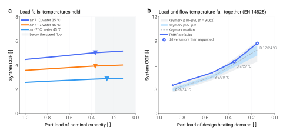

===================
Part-load behaviour
===================

This page exists because the assumption it started from turned out to be wrong,
and the correction changed what the library does.

The assumption was the familiar one: a real inverter heat pump peaks somewhere
around a third of load and falls away below it, so a model whose COP climbs all
the way down must be missing something. The plan was to find the missing
penalty and put it into the compressor efficiency correlations.

.. admonition:: What the certified data actually shows
    :class: important

    Heat Pump Keymark is European third-party certification: an accredited
    laboratory measures to the standard and the declared values are published.
    Reading 18,106 certified records for 9,162 air-to-water models from 169
    manufacturers:

    .. list-table::
        :header-rows: 1
        :widths: 12 14 12 14 16 16 16

        * - Point
          - Outdoor air
          - Part load
          - COP p10
          - p25
          - **median**
          - p75
        * - A
          - −7 °C
          - 0.88
          - 2.61
          - 2.78
          - **2.99**
          - 3.18
        * - B
          - +2 °C
          - 0.54
          - 4.13
          - 4.35
          - **4.53**
          - 4.78
        * - C
          - +7 °C
          - 0.35
          - 5.37
          - 5.74
          - **6.16**
          - 6.56
        * - D
          - +12 °C
          - 0.15
          - 6.40
          - 7.19
          - **7.88**
          - 8.51

    Declared COP rises monotonically from A to D. **97.3 %** of models declare a
    higher COP at the lightest test point than at the next one up, and 96.9 %
    rise at every single step. The roll-over is not there.

    Low-temperature application, average climate. Reproduce with
    ``uv run python -m validation.extraction.keymark_declared``.

The reason is straightforward once stated: EN 14825 lowers the flow temperature
as it lowers the load — 34/30/27/24 °C from A to D for underfloor heating — so
the lift falls together with the duty. The heat exchangers also become large
relative to the duty. Both effects push COP up. (This is also why "W35" and
"W55" name an *application* and not a fixed flow temperature; reading them as
fixed would put three of the four points at the wrong boundary condition.)

So the goal changed: not to manufacture a roll-over, but to carry the low-speed
loss that is genuinely measured, at the size it is measured, and to say plainly
what is not modelled.

Two different curves
====================

        temperatures for three conditions, rising until the compressor reaches
        its speed floor. Right, the EN 14825 test-point trajectory against the
        certified Keymark band.
    :align: center
    :width: 100%

    **(a)** Load falls, temperatures held. **(b)** Load and flow temperature
    fall together, as the certification standard specifies. These are not the
    same question and they do not have the same answer.

Panel (a) — fixed temperatures
------------------------------

Hold the source and sink where they are and take load away. COP rises, for the
heat-exchanger reason alone. The low-speed compressor penalty eats into that
rise but does not reverse it; the two roughly balance into a broad plateau
between about 35 % and 50 % of nominal capacity.

Below that the curve turns over, and the efficiency correlations are not the
cause: a test gates the claim that wherever the modelled COP falls materially
below its peak, the compressor speed equals ``rps_min``.

.. admonition:: Below the speed floor the model delivers its minimum capacity, and says so
    :class: note

    Once the compressor can go no slower the model cannot follow a smaller
    request. Earlier versions matched it anyway by starving the outdoor coil --
    the operating-point search minimised absolute electrical input, and among
    candidates that all sat at the speed floor the one delivering *less* heat
    also drew less power, so the outdoor fan was driven to its 5 % bound and the
    air-side temperature drop reached 17 K against a catalogue maximum near 8 K.
    That was a model artefact, and it has been removed: the search now compares
    candidates on electrical input per unit of heat delivered and rejects any
    that fall short of the request (:mod:`tmhp._opt_utils`). Below the floor the
    model therefore reports ``capacity_clamped == "min"`` together with the heat
    it actually delivers, which exceeds the request -- the *requested* part-load
    ratio and the *actual* capacity ratio are two different numbers, and the
    output carries both.

    Under the same conditions as before (air 7 °C, water 42.5 °C, 9 kW R32) the
    outdoor fan now stays above 44 % of rated flow over the whole sweep and the
    air-side temperature drop stays within 4.1 K; the air-to-air sweep stays
    above 31 % and 4.8 K. A real machine below its modulation floor cycles, and
    TMHP still computes no cycling loss (see below), so the sub-floor rows are a
    continuous-operation figure at the minimum capacity, not a part-load COP.
    They are drawn hollow in the figures and excluded from every trend verdict.

Panel (b) — the certification trajectory
----------------------------------------

This is the curve that has to match, and it does: the modelled trajectory rises
monotonically A → D and sits inside the certified band.

.. list-table::
    :header-rows: 1
    :widths: 10 18 16 16 18 22

    * - Point
      - Condition
      - Required load
      - Delivered
      - TMHP COP
      - Keymark median (p10–p90)
    * - A
      - −7 °C / 34 °C
      - 5.28 kW
      - 5.28 kW
      - 3.41
      - 2.99 (2.61–3.35)
    * - B
      - +2 °C / 30 °C
      - 3.24 kW
      - 3.24 kW
      - 4.74
      - 4.53 (4.13–5.01)
    * - C
      - +7 °C / 27 °C
      - 2.10 kW
      - 2.84 kW
      - 6.03
      - 6.16 (5.37–6.82)
    * - D
      - +12 °C / 24 °C
      - 0.90 kW
      - 3.35 kW
      - 9.05
      - 7.88 (6.40–8.97)

The model runs optimistic at the two ends — above the 90th percentile at A and
at D — and sits on the median in the middle. That is reported as it stands; no
coefficient is adjusted to move it.

.. admonition:: One result nobody put in by hand
    :class: note

    Look at the *delivered* column. At points C and D the modelled machine
    cannot modulate down to the required load and delivers more than the test
    point asks for — 3.35 kW where 0.90 kW is required.

    Certified machines do the same thing. 55 % of Keymark records declare a
    *higher* heat output at point D than at point C, which is the signature of
    a machine sitting on its modulation floor. TMHP reproduces that structure
    from the speed floor alone; nothing was added to produce it.

What is not modelled
====================

.. admonition:: TMHP's low-load COP is a continuous-operation figure
    :class: warning

    Below its modulation floor a real machine cycles on and off. Every start
    pushes the refrigerant pressures away from equilibrium and re-warms the heat
    exchangers, and the standard accounts for that loss with a degradation
    coefficient applied during seasonal integration. TMHP simulates continuous
    operation and computes no such loss, so **at light load it is optimistic
    against a machine that cycles**, and the size of that optimism is not
    estimated here.

This is not an oversight to be patched with a fitted penalty. Cuevas & Lebrun
make the same point from the hardware side: they observe the low-speed
degradation, attribute it to oil starvation, and note that the manufacturer's
own answer is to switch to on/off operation below 35 Hz rather than keep
modulating. The loss lives in the cycling, and the cycling is what is absent.

A second caution concerns the degradation coefficient itself, for anyone
tempted to add one. The published values are not interchangeable: EN 14825
writes ``PLF = 1 − C_d(1 − CR)`` with ``C_d = 0.25``, while Dongellini writes
``f_COP = CR / (1 − C_c + C_c·CR)`` with ``C_c = 0.9``. Carrying a coefficient
from one formulation into the other means something different by it.

Likewise the horizontal axis. EN 14825 divides by the *design heating demand*,
a quantity that does not depend on temperature; Kinab and Dongellini divide by
the full-load capacity at the same temperature, which does. The two differ by
roughly a factor of 1.44 over the −7 to +12 °C range, so plotting both on one
axis produces a figure that means nothing. Panel (a) and panel (b) above use
different denominators for exactly this reason, and are labelled accordingly.

Reproduce
=========

.. code-block:: bash

    uv run python -m validation.extraction.keymark_declared     # the certified band
    uv run python -m scripts.validation.part_load_figure        # both panels
    uv run python -m validation.fixed_boundary_plr.sweep        # internal-state sweep, both models
    uv run python -m validation.fixed_boundary_plr.figure

.. seealso::

    :doc:`defaults`
        The compressor efficiency correlations and the measurements behind them.
