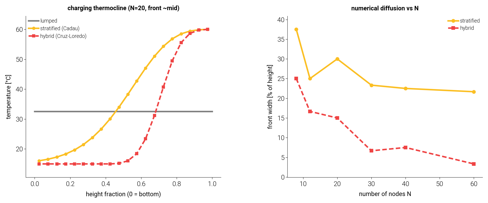
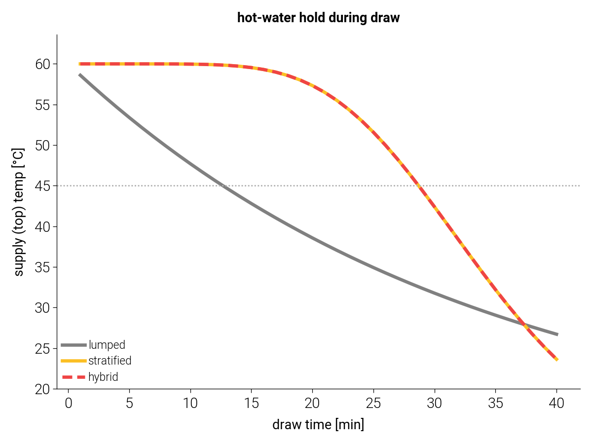

# 탱크 모델 백엔드 — lumped vs 성층(Cadau) vs 하이브리드(Cruz-Loredo)

> tmhp `GroundSourceHeatPumpBoiler`의 저탕탱크를 **교체 가능한 백엔드**로 분리하고
> 3종을 구현·비교한다. 단일노드 lumped(기본·경량), 다노드 성층 smooth(Cadau 2019,
> MPC-internal), 하이브리드 thermocline(De la Cruz-Loredo 2023, plant ground-truth).
> 재현: `.venv/bin/python docs/tank_backends/compare_tank_backends.py`.

---

## 1. 세 백엔드

| 백엔드 | 모델 | 상태 | 성격 | 역할 |
|---|---|---|---|---|
| **lumped** | 단일노드 완전혼합 | T 하나 | 최저충실·경량 | 기본값. 단순 시뮬·하위호환(byte-identical) |
| **stratified** (`StratifiedTank`) | Cadau 2019 1-D 다노드 유한체적 | T[N] (연속) | **매끄러움**(implicit tridiagonal) | MPC 내부모델(LTV/QP·미분가능) |
| **hybrid** (`HybridStratifiedTank`) | Cruz-Loredo 2023 hybrid thermocline | T[N] + y_th | **비매끄러움**·고충실 | plant/ground-truth |

GSHPB에서 `tank_model="lumped"`(기본) 또는 `"stratified"`로 선택한다. lumped 경로는
완전히 보존되어 기존 결과와 **byte-identical**이다.

### 1.1 표준 다노드 (Cadau)

각 노드 i(0=상단/고온)의 에너지밸런스(Cadau Eq.4): 포트·노드간 **상류이류**(upwind) +
이웃간 **pseudo-conduction** `k(T_{i-1}-T_i)-k(T_i-T_{i+1})` + 외벽손실. **backward-Euler
implicit tridiagonal**로 적분 → 무조건 안정·smooth(MPC 적합). N=1이면 lumped 완전 회복.

### 1.2 하이브리드 thermocline (Cruz-Loredo)

표준 다노드의 한계는 **numerical diffusion**: 이류를 노드 단위로 이산화하면 급격한 온도
전이(thermocline)가 여러 노드에 걸쳐 번진다. 하이브리드는 **flat thermocline barrier**를
위치 `y_th`(plug-flow 속도 `v_th=V̇/A_c`로 이동)로 도입하고, **충전 시 각 노드의 상류
이류에 동결된(frozen) reference 온도**를 쓴다 — thermocline front가 그 노드의 중간높이를
지날 때까지 동결. 그래서 전이가 *물리적 front 속도*로 전파되어 번지지 않는다(충전전용
thermocline, Eq.7; 방출·유휴는 barrier 소멸→표준으로 복귀).

> 하이브리드는 front 선명도를 위해 **충전 중 엄격한 스텝별 에너지보존을 의도적으로
> 포기**한다(논문도 에너지보존이 아닌 실험온도 정확도로 검증). 따라서 plant
> ground-truth용이며, MPC 내부모델로는 매끄러운 Cadau를 쓴다.

---

## 2. 결과

### 2.1 충전 thermocline — numerical diffusion (그림 1)

차가운 탱크(15°C)를 60°C로 충전, front가 탱크 중앙에 올 때 프로파일(좌, N=20):
lumped는 공간정보 없이 평탄(혼합온도 한 값), stratified는 **번진 S-curve**, hybrid는
**선명한 step**. front 폭(전이대, 탱크높이 %; 우):

| N | stratified | hybrid |
|---|---|---|
| 8 | 37.5% | 25.0% |
| 20 | 30.0% | 15.0% |
| 30 | 23.3% | 6.7% |
| 60 | 21.7% | **3.3%** |

**stratified는 N을 키워도 front 폭이 ~22%에서 정체**(numerical diffusion). **hybrid는
N↑에 따라 선명해져** N=60서 3.3% — 약 6.5배 선명. 즉 하이브리드는 적은 노드(12)로도
표준의 다(多)노드 충실도를 낸다(논문 주장: hybrid 12노드 ≈ 표준 60노드).

### 2.2 방출 — 온수 공급 유지(성층 유연성, 그림 2)

완충(60°C 균일) 후 하단 냉수 makeup(12°C)으로 연속 방출하며 **공급(상단)온도** 추적.
lumped는 전체가 혼합되어 즉시 하강하나, stratified/hybrid는 상단이 고온을 **유지**(냉수
front가 하단에서 상승)하다 급강. 45°C 이상 유지 시간:

| 백엔드 | 45°C 이상 유지 |
|---|---|
| lumped | 12.0 분 |
| stratified | 28.0 분 |
| hybrid | 28.0 분 |

성층 모델이 **2.3배 긴 온수 윈도우**를 준다 — 같은 저장열로 더 오래 고온수를 공급하거나,
충·방전 시점을 옮길 여지(MPC time-shift 유연성)가 크다. 방출 중에는 hybrid=stratified
(하이브리드 thermocline은 충전 전용).

---

## 3. 언제 무엇을

| 상황 | 백엔드 |
|---|---|
| 단순 시뮬·하위호환·탱크 내부동특성 무관 | **lumped**(기본) |
| MPC 내부예측모델(매끄러움·미분가능 필요) | **stratified**(Cadau) |
| plant/ground-truth, 급격 thermocline 충실 재현, MPC 검증 데이터 | **hybrid**(Cruz-Loredo) |

geolink×tmhp 결합 MPC 연구(G3)에서 hybrid를 plant로, stratified를 MPC 내부모델로 쓰는
two-backend 구성을 의도한다.

---

## 부록 — 정본 자산

| 자산 | 역할 |
|---|---|
| `tmhp.stratified_tank.StratifiedTank` | Cadau smooth 다노드(charge+draw+q_source) |
| `tmhp.hybrid_tank.HybridStratifiedTank` | Cruz-Loredo hybrid thermocline |
| `GroundSourceHeatPumpBoiler(tank_model=...)` | lumped/stratified 선택자 |
| `tests/test_stratified_tank.py`·`test_hybrid_tank.py`·`test_tank_backend.py` | 격리·통합 검증(74 pass) |
| `docs/tank_backends/compare_tank_backends.py` | 본 그림·수치 재현 |

출처: Cadau et al. 2019, Energies 12:4275 · De la Cruz-Loredo et al. 2023, Applied Energy 332:120556.
